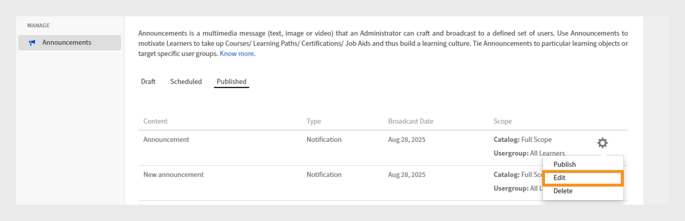
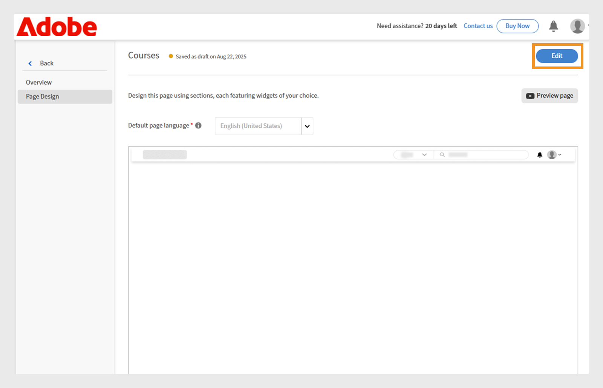
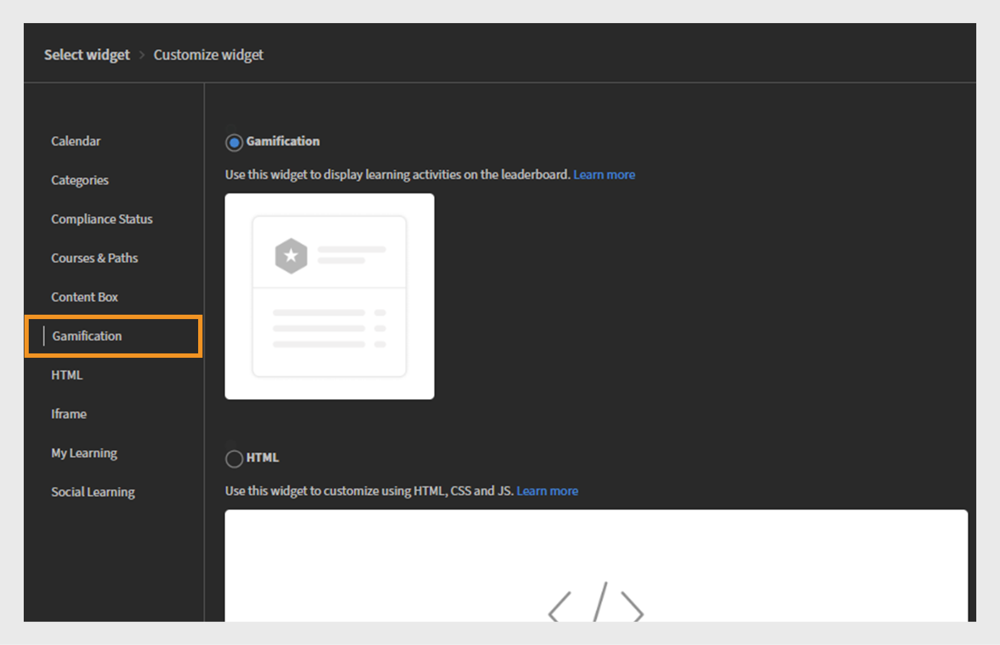
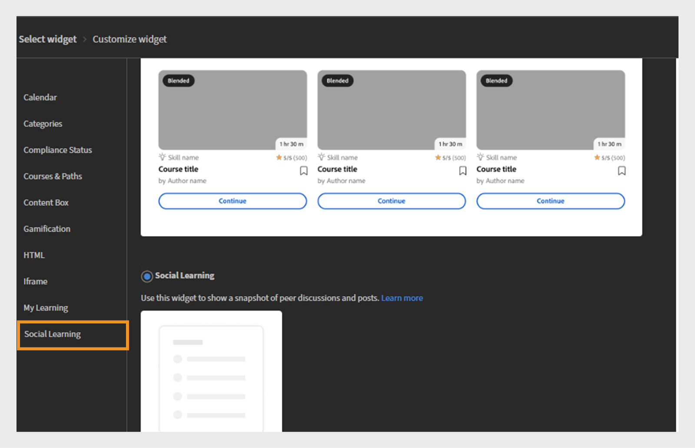

# Nyheter i Adobe Learning Manager oktober 2025-versionen

>[!IMPORTANT]
>
>Observera att de beskrivna funktionerna är trevande och kan komma att ändras. För mer detaljerad information och bekräftelse kan du kontakta din tilldelade kundansvarige. Om du stöter på några problem kontaktar du vårt kundsupportteam på [learningmanagersupport@adobe.com](mailto:learningmanagersupport@adobe.com)

## Översikt över versionen

Oktober 2025-versionen av Adobe Learning Manager innehåller betydande förbättringar som förbättrar rapporteringsnoggrannheten, utökar integreringsfunktionerna och förbättrar utbildningsupplevelsen för administratörer, författare och elever. Viktiga förbättringar omfattar förbättrade elevutskrifter som på ett korrekt sätt tar instruktörsmarkerade slutföranden, utökade användarrapporter med ytterligare identifieringsfält och arbetsstödsrapporter med direkthämtningslänkar.

I den här versionen introduceras även omfångsrika meddelandebehörigheter för anpassade administratörer, funktioner för användartaggning i sociala inlärningsnämnder och språkbaserad framstegsspårning som bevarar elevernas framsteg på olika platser. Ytterligare funktioner omfattar integreringsförbättringar av Go1 med AI-assisterad spellista, förbättrad anpassad rollhantering med inkrementellt importstöd och förbättrade API:er för bättre quiz-prestandaspårning och övervakning av migreringsstatus.

## Instruktörsmarkerade slutföranden i elevbetygsutdrag

**Översikt**

Inkrementella elevbetygsutdrag fångar nu instruktörsmarkerade slutföranden, även om närvaro registreras efter sessionsdatumet.
Denna förbättring åtgärdar ett kritiskt avbrott i inkrementella elevutskrifter där instruktörsmärkta slutföranden tidigare missades om närvaro registrerades efter det ursprungliga sessionsdatumet.

Inkrementella elevbetygsutdrag är schemalagda rapporter som endast samlar de ändringar (t.ex. slutföranden eller framstegsuppdateringar) som sker inom en angiven period, snarare än att tillhandahålla en fullständig historisk datadumpning. De används ofta för automatisering, instrumentpaneler och integreringar, vilket gör det möjligt för användare att effektivt spåra senaste utbildningsaktiviteter utan att bearbeta hela transkriptionshistoriken varje gång.

**Nyheter**

* **Markera som slutförd datum (tidszonen UTC)**: En ny tidsstämpelkolumn som anger exakt datum och tid när en instruktör markerar en session eller modul som slutförd.
* **Förbättrad källspårning för slutförande**: Spårar den specifika instruktören och modulen (till exempel &quot;Classroom&quot;) där slutföranden spelades in.

Dessa ändringar säkerställer att slutföranden markerade efter sessionsdatumet återspeglas korrekt i inkrementella elevens betygsutdrag.

**Viktiga fördelar**

* Alla slutföranden registreras i inkrementella rapporter, oavsett när närvaro har angetts.
* Ger en tydlig verifieringskedja för efterlevnad och rapportering.
* Stödjer automatisering och instrumentpaneler för lagstadgade krav.

**Användningsfall**

* Organisationer med klassrumssessioner där instruktörer kan markera närvarodagar efter den faktiska sessionen.
* Automatiserade system eller instrumentpaneler som är beroende av inkrementella elevutskrifter för efterlevnad eller rapportering.

### Elevens betygsutdrag med den nya kolumnen

Titta i den här [artikeln](/help/migrated/administrators/feature-summary/learner-transcripts.md) om du vill veta mer om hur du hämtar elevens betygsutdrag.

Den nedladdade rapporten över elevens betygsutdrag innehåller den nya kolumnen: Markera som slutförd den (tidszonen UTC).


_Elevens betygsrapport visar en ny kolumn i gult som visar enskilda slutförandedatum för varje användare_

## Förbättrad användarrapport med utökade datafält

**Översikt**

Användarrapporten innehåller nu ytterligare fält för att förbättra användarspårning och organisationsmappning.

**Nyheter**

* Kolumnen Internt användar-ID: tillhandahåller unika interna identifierare för smidig användarspårning i olika system och API-slutpunkter.
* E-postkolumn för chef: Innehåller kontaktinformation för direktchef för spårning av organisationshierarki.

**Viktiga fördelar**

* Förenklad användaridentifiering och eliminerar problem när användare mappas över flera system.
* Stöder arbetsflöden för hantering av nedströmsanvändare genom integreringsfunktioner.
* Förbättrad organisationskarta och bättre förståelse för rapporteringsrelationer.
* Bibehåller organisatoriska gränser och förhindrar oavsiktlig korskommunikation.

**Viktiga överväganden**

* Om en anpassad administratörs omfång ändras, visas en varningsikon för de meddelanden som påverkas och individuella omfång återställs.
* Varje meddelande måste uppdateras individuellt när omfånget ändras.
* Meddelanderapporten visar endast elever inom den anpassade administratörens tilldelade omfång.

### Användarrapport med den nya kolumnen

Om du vill ha mer information om hur du hämtar användarrapporten läser du i den här [artikeln](/help/migrated/administrators/feature-summary/reports.md#user-activity-dashboards).

Den hämtade användarrapportfilen innehåller de nya kolumnerna: Internt användar-ID och chefens e-postadress.


_Användarrapporter som visar interna användar-ID:n och chefens e-postadresser för att effektivisera användarhanteringen_

## FTP-användarrapport med stöd för internt användar-ID

**Översikt**

Den FTP-baserade användarrapporten innehåller nu stöd för internt användar-ID, vilket ger ett enhetligt sätt att exportera och integrera data för fjärradministrerade implementeringar.

**Nyheter**

* Användarrapporter är nu tillgängliga via [Anpassad FTP](/help/migrated/integration-admin/feature-summary/connectors.md#custom-ftp) tillsammans med befintliga rapporter (spelifieringsutskrifter, elevutskrifter, utbildningsrapport).
* Kolumnen Internt användar-ID är nu konsekvent över alla exportmetoder (FTP, jobb-API och UI).

**Viktiga fördelar**

* Förenklad datahantering med en enda källa för alla nödvändiga rapporter.
* Bättre konsekvens i uppgifterna genom att säkerställa en enhetlig användaridentifiering under rapporteringsperioderna.
* Automatiserat arbetsflödesstöd genom att aktivera massåtgärder och analysarbetsflöden med konsekventa identifierare.
Användarrapporten som hämtats från FTP-mappen innehåller den nya kolumnen, Internt användar-ID.

## Inkludera avbrutna användare i elevens betygsutdrag

**Översikt**

Organisationer kan nu inkludera avstängda användare (de med inaktiverade externa profiler) i elevens betygsutdrag för att säkerställa omfattande lagring av historiska inlärningsdata.

**Nyheter**

* Konfigurerbar avbruten användarsynlighet med en flagga på kontonivå för att inkludera avbrutna användare i elevens betygsutdrag.
* Tidigare lagring av uppgifter även efter inaktivering av externa profiler som hängt sig.

**Implementeringskrav**

* Kontakta din CSM (Customer Success Manager) för att aktivera flaggan på kontonivå.

>[!NOTE]
>
>Flaggan är inaktiverad som standard för befintliga konton och måste uttryckligen begäras för nya konton.

## Omfattade behörigheter för meddelanden för anpassade administratörer

**Översikt**

Anpassade administratörer kan nu skapa meddelanden, men bara för sina tilldelade användargrupper eller kataloger. Detta förhindrar oavsiktlig kommunikation över organisatoriska gränser.

**Nyheter**

* Anpassade administratörer kan bara skapa meddelanden för användare inom sitt tilldelade omfång.
* Meddelanden kan omfattas av specifika användargrupper eller kataloger.
* Fullständiga administratörer behåller synligheten och kontrollen över alla meddelanden, inklusive de som skapas av anpassade administratörer med omfång.

**Viktiga fördelar**

* Riktad kommunikation som ser till att meddelanden når ut till enbart relevanta målgrupper.
* Minskad överbelastning av informationen genom att förhindra att irrelevanta meddelanden når oavsiktliga användare.
* Bibehåller organisatoriska gränser och förhindrar oavsiktlig korskommunikation.

**Viktiga överväganden**

* Om en anpassad administratörs omfång ändras, visas en varningsikon för de meddelanden som påverkas och individuella omfång återställs.
* Varje meddelande måste uppdateras individuellt när omfånget ändras.
* Meddelanderapporten visar endast elever inom den anpassade administratörens tilldelade omfång.

**Användningsfall**

* Franchiseorganisationer där regionala chefer bara behöver kommunicera med sina franchisetagare.
* Stora organisationer med regionala administratörer eller avdelningsadministratörer som skickar meddelanden till sina team.

### Skapa meddelande för det tilldelade omfånget

En anpassad administratör kan skapa meddelanden som är begränsade till de användargrupper och kataloger som de tilldelats, vilket säkerställer att meddelandena når rätt målgrupp och förhindrar onödiga meddelanden.

Så här skapar du ett meddelande för det tilldelade omfånget:

1. Logga in på Adobe Learning Manager som administratör.
2. Välj **[!UICONTROL Announcement]** i den vänstra navigeringsrutan.
3. Välj **[!UICONTROL Add]**.

   
   _Sidan Meddelanden i Adobe Learning Manager, där administratörer kan skapa och hantera meddelanden för målanvändargrupper_

4. Välj **[!UICONTROL Announcement Type]** i listrutan.
a. **[!UICONTROL As Notification]**
b. **[!UICONTROL As Masthead]**
c. **[!UICONTROL As Recommendation]**
d. **[!UICONTROL As Email]**
5. Välj **[!UICONTROL As Masthead]**.
6. Välj språk och överför en bild för masthead.
7. Du kan även lägga till en URL till åtgärdsknappen.

   
   _Skapa en meddelandeskärm där administratörer kan ange meddelandetyp, överföra bilagor och lägga till åtgärdsknappar_

   Det tilldelade omfånget är förvalt i avsnittet **[!UICONTROL Scope]** och kan inte ändras av administratörer.

   >[!NOTE]
   >
   >**[!UICONTROL For Notification]**- och **[!UICONTROL Email]**-meddelanden, de kan innehålla ytterligare användargrupper och kataloger om dessa överlappar deras tilldelade omfång.

8. Välj **[!UICONTROL Save]**.

Det är bara elever inom den anpassade administratörens omfattning som kan se meddelandet. Om du vill ha mer information om hur du skapar flera typer av meddelanden läser du i den här [artikeln](/help/migrated/administrators/feature-summary/announcements.md).

### Återställ omfattningen av anpassade administratörer

Anpassade administratörer kan återställa omfattningen av sina publicerade meddelanden om en administratör har ändrat deras omfattning. När omfattningen har återställts tillämpas det uppdaterade omfånget på tillkännagivandet och endast elever inom det nya omfånget kan se tillkännagivandet.

Så här återställer du omfånget:

1. Logga in på Adobe Learning Manager som en anpassad administratör.
2. Välj **[!UICONTROL Announcement]** i den vänstra navigeringsrutan.
3. Välj fliken **[!UICONTROL Published]**.
4. Välj ett meddelande och välj sedan inställningsikon.
5. Välj **[!UICONTROL Edit]**.

   
   _Meddelandeskärmen visar de publicerade meddelandena med alternativ för redigering, publicering och annat_

6. Välj **Återställ**.

   
   _Meddelande som visar ett meddelande om scopeändring, med ett alternativ för anpassade administratörer att återställa och uppdatera scopevalet för att återspegla nya åtkomstbehörigheter_

Omfattningen uppdateras och endast användare inom det uppdaterade omfånget kan se tillkännagivandet.

### Redigera meddelandet via administratörsgränssnittet

Administratörer kan se meddelanden som skapats av anpassade administratörer via deras gränssnitt. De kan endast redigera dessa meddelanden genom att ändra eller ta bort det tilldelade omfånget. Om omfångsändringar inte görs kan administratörer inte redigera meddelandet ytterligare.

Så här redigerar du meddelandet via administratörsgränssnittet:

1. Logga in på Adobe Learning Manager som administratör.
2. Välj **[!UICONTROL Announcement]** i den vänstra navigeringsrutan.
3. Välj fliken **[!UICONTROL Published]**.
4. Välj ett meddelande och välj sedan inställningsikon.
5. Välj **[!UICONTROL Edit]**.

   
   _Meddelandeskärmen visar de publicerade meddelandena med alternativ för redigering, publicering och annat_

6. Välj **[!UICONTROL Remove]**.

   
   _En meddelandeskärm som anger att omfånget måste tas bort för att administratörer ska kunna redigera meddelanden som skapats för användargrupper med omfång_

Administratören kan redigera meddelandet efter att omfånget har tagits bort.

## Tagga användare på sociala anslagstavlor

**Översikt**

Sociala inlärningsnämnder stöder nu användartaggning, vilket möjliggör mer riktade diskussioner och förbättrat samarbete inom inlärningsgrupper. Elever kan taggas i inlägg om social utbildning och kommentarer via elevappen, API:er och referenswebbplatsen för Adobe Learning Manager.

**Nyheter**

* **@username**: Användarna kan tagga andra tavlans medlemmar med formatet @username.
* **Omfångsbegränsad taggning**: Endast användare med åtkomst till den specifika tavlan kan taggas, vilket garanterar sekretess och relevans.
* **Flerkanalsmeddelanden**: Taggade användare får både aviseringar i appen och e-postmeddelanden med direktlänkar till relevanta inlägg eller kommentarer.

**Viktiga funktioner**

* Användare utanför tavlans omfattning kan inte taggas, vilket förhindrar oönskade meddelanden.
* Om en taggad användare tas bort från systemet visas användarens omnämnande som &quot;anonym&quot;.
* Det är inte tillåtet att tagga användargrupper eller &quot;@all&quot; för att förhindra skräppost.

**Användningsfall**

* Hälso- och sjukvårdspersonal som vill ha synpunkter från särskilda kollegor om medicinska fall.
* Ämnesområde Experter rådfrågas i specialfrågor.
* Gruppdiskussioner som kräver synpunkter från specifika intressenter.
* Sessioner för kunskapsdelning med riktade experter inblandade.

### Tagga användare i inlägg på sociala anslagstavlor

Elever kan nu tagga specifika styrelseledamöter i inlägg eller kommentarer med hjälp av @username. Taggning är begränsad till medlemmar med tillgång till den tavlan.

Så här taggar du användare på en social tavla:

1. Logga in på Adobe Learning Manager som elev.
2. Välj **[!UICONTROL Social Learning]** i den vänstra navigeringsrutan.

   
   _Aktivera kollaborativ utbildning genom att välja Social utbildning för att komma åt diskussionstavlor, dela insikter och tagga användare för interaktivt engagemang_

3. Välj **[!UICONTROL New Post]**.

   
   _Starta en ny diskussion genom att välja Nytt inlägg i Social utbildning för att dela kunskap med taggade användare_

4. Innan du lägger till märkord till användare väljer du tavlan från alternativet **[!UICONTROL Post this to a Discussion Board]**.

   
   _Välj en diskussionstavla där du kan publicera och tagga användare, vilket möjliggör riktade samtalsämnen i social utbildning_

5. Skriv dina inläggsuppgifter och tagga sedan en användare genom att ange @-symbolen följt av användarens namn (till exempel @andrew). När du skriver @ följt av de tre första bokstäverna i användarens namn visas en lista med matchande användare.

   
   _Tagga användare i ditt diskussionsinlägg genom att skriva @ följt av användarnamnet för att möjliggöra riktat samarbete inom tavlor för social utbildning_

6. Välj önskad användare i listan.
7. Välj **[!UICONTROL Post]**.

De taggade användarna får både meddelanden i appen och via e-post med en direkt länk till inlägget, vilket gör diskussionerna mer riktade och samarbetsinriktade.

### Tagga användare utifrån styrelsens omfattning

Omfångsbegränsad taggning gör att användare endast kan tagga elever som har behörighet för åtkomst till en viss tavla. Detta hjälper till att upprätthålla sekretessen genom att förhindra att användare taggas utanför omfånget.

Om du försöker tagga elever som ligger utanför tavlans omfattning visas inga förslag och du kan inte tagga dem. Läs den här [artikeln](/help/migrated/administrators/feature-summary/social-learning-configurations-as-an-admin.md) om du vill veta mer om omfattningen av social utbildning.

## Tagga borttagna användare i kommentarer

Om en användare som har tagits bort taggas i ett inlägg i Social utbildning visas användarens namn som Anonym i inlägget. Kommentaren och taggen visas fortfarande i sammanhanget, men inte profillänken eller -uppgifterna.


_Inlägg från social utbildning visar hur en borttagen användare visas som anonym när den är taggad_

## Rapport om arbetsstöd med direktlänkar

**Översikt**

Rapporten om arbetsstöd har förbättrats så att den innehåller direkthämtningslänkar till arbetsstöd, effektivisering av innehållshantering och granskningsprocesser för administratörer och författare.

**Nyheter**

* Kolumnen Arbetsstödslänk: Direkt åtkomst till filer för arbetsstöd och externa URL:er i rapporten.
* Rollbaserad åtkomstkontroll: Länkåtkomsten beror på användarroller och katalogbehörigheter.
* Borttagna arbetsstöd förblir tillgängliga om de fortfarande är kopplade till aktiva kurser.

**Viktiga fördelar**

* Direkta filhämtningar och URL-åtkomst inifrån rapporten.
* Slipp manuella försök med att hitta och ladda ner arbetsstöd för efterlevnad eller tillgänglighetsgranskningar.

**Användningsfall**

* Författare eller administratörer genomför regelbundna tillgänglighetsgranskningar av arbetsstöd i enlighet med kraven från stora organisationer.
* Alla scenarier där snabb, rollbaserad åtkomst till arbetsstödsfiler behövs för granskning eller efterlevnad.

### Arbetsstödsrapport med den nya kolumnen

Titta i den här [artikeln](/help/migrated/administrators/feature-summary/reports.md#job-aids-report) om du vill veta mer om hur du hämtar rapporten om arbetsstöd.

Arbetsstödsrapporten kan laddas ned från avsnittet Rapporter och innehåller nu direkthämtningslänkar för varje arbetsstöd.


_Arbetsstödsrapporten visar direkthämtningslänkar för att göra det enkelt att komma åt och hämta arbetsstöd i Adobe Learning Manager_

## API-uppdateringar

### Förbättringar av elevs-API för prestandaspårning

**Översikt**

API:t `GET /loResourceGrades` har förbättrats för att tillhandahålla detaljerade information om frågesportens prestanda, vilket möjliggör mer avancerade analyser och automatiserat beslutsfattande.

**Nyheter**

API-svaret innehåller nu ytterligare två fält:

* **[!UICONTROL highestScore]**: Det bästa resultatet som en elev har uppnått under alla frågeformulärsförsök
* **[!UICONTROL maxScore]**: Total möjlig poäng för quiz

**Exempel på API-svar**

```
{
    "links": {
        "self": "https://learningmanagerstage1.adobe.com/primeapi/v2/loResourceGrades/course:15067_30122_41715_1_3400468"
    },
    "data": {
        "id": "course:15067_30122_41715_1_3400468",
        "type": "learningObjectResourceGrade",
        "attributes": {
            "completed": false,
            "duration": 0,
            "hasPassed": false,
            "highestScore": 0,
            "maxScore": 0,. 
            "progressPercent": 0,
            "score": 0
        },
        "relationships": {
            "loResource": {
                "data": {
                    "id": "course:15067_30122_41715_1",
                    "type": "learningObjectResource"
                }
            }
        }
    }
}
```

Som svar är **kurs:15067_30122_41715_1_3400468** ID:t för utbildningsobjektets resursgrad som informationen begärs för. Du kan hämta `learningObjectResourceGrad`e-id från API:t `GET /enrollments/{id}`.

**Viktiga fördelar**

* Möjliggör detaljerad quiz-prestandaanalys för mätning av inlärningseffektivitet.
* Stöder progressionsregler baserat på högsta möjliga resultat snarare än de senaste försöken.
* Ger en fullständig bild av elevfrågeformulärets prestanda över tid.

**Så här fungerar API:t**

1. En användare försöker utföra ett quiz flera gånger. Varje försök registreras.
2. API:t ger både högsta uppnådda poäng och högsta möjliga poäng i quiz.
3. Externa system kan använda dessa data för att utlösa automatiska åtgärder, till exempel att registrera användare i nya kurser baserat på deras bästa prestanda.

**Användningsfall**

* För fjärradministrerade utbildningssystem krävs automatiska beslut vid registrering.
* Plattformar för utbildningsanalys spårar mönster för elevprestationer.
* Överensstämmelsesystem med prestandabaserade progressionskrav.

### Förbättringar av migrerings-API

**Översikt**
Adobe Learning Manager stöder nu migrering av olika dataobjekt till ett konto via migreringsprocessen. Denna process kan initieras via både API:er och användargränssnittet. När en migrering misslyckas är fel tillgängliga för hämtning via gränssnittet. De här felen är användbara vid felsökning av migreringsfel och hantering av migreringskörningar.

I den här versionen kommer felloggarna också att vara tillgängliga att hämta via API:erna för effektiv, programmatisk felspårning och felsökning.

**API-ändringar**

Det finns ett nytt migrerings-API, `runStatus`, som gör att integreringsadministratörer kan kontrollera statusen för migreringskörningar som utlösts via API:t. Detta är inte möjligt i tidigare versioner av Adobe Learning Manager.

Dessutom tillhandahåller `runStatus` API nu en direktlänk för att hämta felloggar (CSV) för slutförda körningar. Observera att länken endast är giltig i sju dagar, och loggarna sparas i en månad.

API-svaret för `startRun` har uppdaterats för att inkludera migreringsprojektets ID, sprint-ID och sprint-körnings-ID, som krävs för att fråga den nya statusslutpunkten.

#### runStatus API

**Beskrivning**

Hämtar status för en befintlig migreringskörning.

**Slutpunkt**

```
GET /bulkimport/runStatus
```

**Parametrar**

* **migrationProjectId**: (obligatoriskt). En unik identifierare för ett migreringsprojekt. Ett migreringsprojekt används för att överföra data och innehåll från ett befintligt system för hantering av inlärning (LMS) till Adobe Learning Manager. Varje migreringsprojekt kan bestå av flera sprintar, som är mindre enheter för migreringsuppgifter.

* **sprintId**: (obligatoriskt). En unik identifierare för ett sprint inom ett migreringsprojekt. Ett språng är en delmängd migreringsuppgifter som omfattar specifika utbildningsobjekt (t.ex. kurser, moduler och elevposter) som ska migreras från ett befintligt LMS till Adobe Learning Manager. Varje sprint kan utföras oberoende av varandra, vilket möjliggör en stegvis migration.

* **sprintRunId**: (obligatoriskt). En unik identifierare som används för att spåra körningen av ett specifikt sprint inom ett migreringsprojekt. Det är kopplat till den faktiska migreringsprocessen för de objekt som definieras i en sprint. SprintRunId hjälper till att övervaka, felsöka och hantera migreringsjobbet.

**Svar**

```
{
  "sprintId": 2510080,
  "sprintRunId": 2740845,
  "migrationProjectId": 2509173,
  "startTime": 1746524711052,
  "endTime": 1746524711052,
  [
    {
      "id": 2609923,
      "lastHeartbeatTime": 1746524711052,
      "objectName": "content",
      "jobState": "COMPLETED",
      "errorCsvLink": "",
      "errorLogLink": "migration/5830/2509173/2510080/2740845/content_err.csv",
      "sequenceNumber": 1
    },
    {
      "id": 2609922,
      "lastHeartbeatTime": 1746524713577,
      "objectName": "course",
      "jobState": "WAITING_IN_QUEUE",
      "errorCsvLink": "",
      "errorLogLink": null,
      "sequenceNumber": 2
    }
  ]
}
```

#### startRun-API

API-svaret `startRun` uppdaterades så att det inkluderade ytterligare tre fält - migrationProjectId, sprintId och sprintRunId. Dessa fält gör det möjligt för användare att spåra och fråga status för specifika migreringskörningar med det nya runStatus-API:et.

```
curl -X GET --header 'Accept: text/html' 'https://learningmanager.adobe.com/primeapi/v2/bulkimport/runStatus?migrationProjectId=001&sprintId=10001&sprintRunId=7'
```

Ger följande svar. Svaret innehåller:

* migrationId
* sprintId
* sprintRunId

**Svar**

```
{
  "status": "OK",
  "title": "BULKIMPORT_RUN_INITIATED_SUCCESSFULLY",
  "source": {
    "info": "Success",
    "migrationInfo": {
      "migrationProjectId": "001",
      "sprintId": "10001",
      "sprintRunId": "7"
    }
  }
}
```

### Ändringar i socialt API (användartagg, kommentarer och svar)

**Översikt**

Adobe Learning Manager har nu stöd för @user taggning i Social Learning Boards. Det gör det möjligt för elever att nämna och meddela kollegor i inlägg, kommentarer och svar. Den här funktionen förbättrar samarbetet och innehållsidentifieringen på plattformen.

Den här versionen introducerar nya API-funktioner för att stödja användaromnämnanden, däribland förbättrade slutpunkter för POST och GET samt en ny sökfunktion för taggade användare.

**Översikt över API-ändringar**

* Uppdaterade POST-API:er för att skapa inlägg/kommentarer/svar med användaromnämnanden
* API:er för GET har uppdaterats med användaromnämnandedata i svar

**Format för användaromnämnanden**

En användare omnämns med formatet: @(användare:userId)

#### Skapa inlägg med omnämnanden

**Slutpunkt**

```
POST /primeapi/v2/posts
```

**Beskrivning**

Skapa ett nytt inlägg om social utbildning med användaromnämnanden.

**Text för begäran**

```
{
  "data": {
    "type": "post",
    "attributes": {
      "boardId": 13282,
      "accountId": 11152,
      "text": "<p>This is a new post mentioning @[user:11257229]</p>",
      "createdByUserId": 11257228,
      "postType": "discussion"
    },
    "id": null
  }
}
```

**Svar**

Standardsvar efter skapande med omnämnandedata som ingår i relationen _userMentions_.

#### Skapa kommentar med omnämnanden

**Slutpunkt**

```
POST /primeapi/v2/comments
```

**Beskrivning**

Lägg till en kommentar till ett inlägg med användaromnämnanden.

**Text för begäran**

```
{
  "data": {
    "type": "comment",
    "attributes": {
      "postId": 20746,
      "accountId": 11152,
      "text": "<p>Test Comment @[user:11257229]</p>",
      "createdByUserId": 11257228,
      "commentLevel": 0
    },
    "id": null
  }
}
```

#### Skapa svar med omnämnanden

**Slutpunkt**

```
POST /primeapi/v2/replies
```

**Beskrivning**

Svara på en kommentar med användaromnämnanden.

**Text för begäran**

```
{
  "data": {
    "type": "reply",
    "attributes": {
      "postId": 20746,
      "accountId": 11152,
      "text": "<p>Thanks for the update @[user:11257229]</p>",
      "createdByUserId": 11257228,
      "commentLevel": 1,
      "parentCommentId": 55621
    },
    "id": null
  }
}
```

#### Hämta inlägg med omnämnanden

**Slutpunkt**

```
GET /primeapi/v2/posts/{id}
```

**Beskrivning**

Hämta inläggsinformation, inklusive nämnda användare.

**Svar**

```
{
  "links": {
    "self": "https://learningmanager.adobe.com/primeapi/v2/posts/7522"
  },
  "data": {
    "id": "7522",
    "type": "post",
    "attributes": {
      "commentCount": 3,
      "dateCreated": "2025-06-10T11:33:29.000Z",
      "dateUpdated": "2025-06-25T14:52:04.000Z",
      "downVote": 0,
      "postingType": "DEFAULT",
      "richText": "<p>my updated fourth post @[user:14707776] second mention my first post</p>",
      "state": "ACTIVE",
      "text": "my updated fourth post @[user:14707776] second mention my first post",
      "upVote": 0,
      "viewsCount": 0
    },
    "relationships": {
      "createdBy": {
        "data": {
          "id": "14707776",
          "type": "user"
        }
      },
      "parent": {
        "data": {
          "id": "3971",
          "type": "board"
        }
      },
      "userMentions": {
        "data": [
          {
            "id": "14707776",
            "type": "user"
          }
        ]
      }
    }
  },
  "included": [
    {
      "id": "14707776",
      "type": "user",
      "attributes": {
        "avatarUrl": "https://cpcontents.adobe.com/public/images/default_user_avatar.svg",
        "binUserId": "45664b87-75a3-43ec-b0b7-5064958eac6f",
        "email": "user@example.com",
        "enrollOnClick": false,
        "fields": {
          "Location": "BLR"
        },
        "gamificationEnabled": true,
        "lastLoginDate": "2025-06-27T11:21:17.000Z",
        "name": "John Doe",
        "pointsEarned": 1690,
        "pointsRedeemed": 0,
        "preferredResolution": "AUTO",
        "profile": "admin",
        "roles": [
          "Learner",
          "Admin",
          "Author",
          "Instructor",
          "Integration Admin",
          "Manager"
        ],
        "state": "ACTIVE",
        "userType": "Internal"
      },
      "relationships": {
        "account": {
          "data": {
            "id": "9238",
            "type": "account"
          }
        }
      }
    }
  ]
}
```

### Ändringar i socialt API (användarsökning)

**Slutpunkt**

```
GET /primeapi/v2/users/search?q={searchTerm}&context=tagging
```

**Beskrivning**

Sök efter användare som är tillgängliga för taggning baserat på inställningarna för socialt omfång.

**Parametrar för förfrågan**


* q (obligatoriskt): Sökord (minst 3 tecken).
* kontext: Ställ in som &quot;taggning&quot; för att få användare berättigade till omnämnanden.
* boardId (valfritt): Tavlans-id för att filtrera användare baserat på åtkomstbehörigheter.

**Svar**

```
{
  "data": [
    {
      "id": "11257229",
      "type": "user",
      "attributes": {
        "name": "Jane Smith",
        "email": "jane.smith@example.com",
        "avatarUrl": "https://cpcontents.adobe.com/public/images/default_user_avatar.svg",
        "userType": "Internal",
        "state": "ACTIVE"
      }
    }
  ]
}
```

### Riktlinjer för genomförandet

#### Teckengränser

* Inlägg: 4 000 teckengräns gäller, där varje taggad användare minskar antalet tillgängliga tecken med ett fast belopp.
* Kommentarer: Högst 1 000 tecken.

#### Nämn validering

* Användare kan bara taggas med användarnamn eller e-postadress (inte UUID).
* Interna användare kan inte tagga externa användare och vice versa.
* Taggningstillgängligheten följer de befintliga inställningarna för socialt omfång.
* Tavlans behörigheter avgör om du är berättigad till taggar (offentlig/privat).

#### Meddelanden

* Flera omnämnanden av samma användare i ett inlägg resulterar i ett enda meddelande.
* Ursprunglig inläggsägare får endast meddelanden när de är specifikt taggade.

#### Felhantering

* Ogiltiga användar-ID:n i omnämnanden returnerar valideringsfel.
* GDPR och soft-deleted-användare visas anonymt i taggat innehåll.

### Språkbaserad elevstatus

För närvarande spåras elevens framsteg endast för det valda språkområdet, vilket orsakar betydande förluster av framsteg när man byter språk/språkinställningar i spelaren. Den här begränsningen skapar en dålig användarupplevelse när elever förlorar sina utbildningsframsteg när de utforskar innehåll på olika språk.

**Aktuella problem**

* **Förloppsåsidosättning**: Förloppet för varje modul i spelaren spåras på både användar- och modulnivå. Detta leder till en situation där en användares förlopp åsidosätts när hen växlar tillbaka till ett tidigare använt språk för samma modul.
* **Förloppsåterställning**: Om en elev till exempel uppnår 75 % förlopp i Språkversion A (engelska) och sedan byter till Språkversion B (spanska), återställs förloppet till 0 % när hen återgår till Språkversion A, i stället för 75 %.

För att åtgärda dessa begränsningar har API förbättrats så att det stöder språkspecifik framstegsspårning:

* **Språkspecifik lagring**: När en elev byter språkversion (till exempel från språk A till språk B) i spelaren, sparas nu förloppsstatusen separat i systemet för varje språk i innehållet.
* **Återupptagande av förloppet**: När användaren växlar tillbaka till ett tidigare använt språk (från språk B tillbaka till språk A), återupptas innehållet där det slutade på det språket.
* **Oberoende framstegsspårning**: Varje språk bibehåller sitt eget framstegsläge, vilket gör att elever kan utforska innehåll på flera språk utan att förlora sina individuella framsteg på varje språk.

#### API-ändringar

Följande API:er har förbättrats för att stödja den nya nationella parametern:

* GET Player State API
* POST Player State API

#### GET Player State API

**Slutpunkt**

```
GET /primeapi/v2/users/{userId}/playerState
```

**Beskrivning**

Hämtar det aktuella läget för ett utbildningsobjekt för en specifik användare och språkområde.

**Parametrar**

| Parameter | Typ | Plats | Obligatorisk | Beskrivning |
|---|---|---|---|---|
| userId | Sträng | Bana | Ja | Unik identifierare för användaren |
| loId | Sträng | Fråga | Ja | Identifierare för utbildningsobjekt i formatloggen:{id} |
| loResourceId | Sträng | Fråga | Ja | Resursidentifierare för utbildningsobjekt i formatkurs:{loId_loInstanceId_moduleId_moduleVersion} |
| csrf_token | Sträng | Fråga | Ja | CSRF-skyddstoken |
| språkområde | Sträng | Fråga | Valfritt | Språkidentifierare för språkspecifikt förlopp (t.ex. &quot;en-US&quot;, &quot;es-ES&quot;) |

**Exempelbegäran**

```
GET /primeapi/v2/users/12345/playerState?loId=lo:67890&loResourceId=course:67890_1_mod123_v2&csrf_token=abc123&locale=en-US
```

**Svarsbeteende**

* Om parametern locale anges och det finns ett språkspecifikt tillstånd, returnerar API förloppet för det språkområdet.
* Om parametern locale anges men det inte finns något språkspecifikt tillstånd, utför API en grundsökning för standardläget.
* Om parametern locale utelämnas returnerar API standardläget (bibehåller bakåtkompatibilitet).
* För fjärradministrerade begäranden där språkinställningen är null återgår API till standardlägessökningen.

#### POST Player State API

**Slutpunkt**

POST /primeapi/v2/users/{userId}/playerState

**Beskrivning**

Uppdaterar eller skapar det aktuella läget för ett utbildningsobjekt för en specifik användare och språkområde.

**Parametrar**

| Parameter | Typ | Plats | Obligatorisk | Beskrivning |
|---|---|---|---|---|
| userId | Sträng | Bana | Ja | Unik identifierare för användaren |
| loId | Sträng | Fråga | Ja | Identifierare för utbildningsobjekt i formatloggen:{id} |
| loResourceId | Sträng | Fråga | Ja | Resursidentifierare för utbildningsobjekt i formatkurs:{loId_loInstanceId_moduleId_moduleVersion} |
| csrf_token | Sträng | Fråga | Ja | CSRF-skyddstoken |
| språkområde | Sträng | Fråga | Valfritt | Språkidentifierare för language-sp |

**Text för begäran**

Förfrågningstexten innehåller specifika data för utbildningsobjektets tillstånd.

**Exempelbegäran**

```
POST /primeapi/v2/users/12345/playerState?loId=lo:67890&loResourceId=course:67890_1_mod123_v2&csrf_token=abc123&locale=en-US
```

```
{
  "progress": 75,
  "completionStatus": "incomplete",
  "timeSpent": 1800,
  "lastAccessedPage": 5,
  // Additional state data
}
```

API:t skapar eller uppdaterar utbildningsobjektets tillstånd för det angivna språket.

## Go1-integreringsförbättringar

**Översikt**

Go1-integreringen har förbättrats så att du kan gå vidare med Go1-kurser för att skapa utbildningsprogram (LP) i Adobe Learning Manager. Denna uppdatering stödjer inkluderandet av Go1-kurser i återkommande certifieringar och introducerar en ny version av Go1-innehållsnavet som möjliggör effektivare kurskurser.

**Nyheter**

* Skapa och hantera spellistor direkt i Go1 med hjälp av AI-chattassistans eller manuellt val.
* Inkludera Go1-kurser i återkommande certifieringscykler med automatisk återställning av förloppet.
* Uppgraderat gränssnitt för innehållsidentifiering för förbättrad bläddring och kuratering av innehåll.

**Viktiga fördelar**

* Skapande av AI-stödda spellistor snabbar upp gruppering och leverans av innehåll avsevärt.
* Möjliggör användning av Go1-innehåll för återkommande krav på regelmässig utbildning.
* Tydlig förhandsgransknings- och inköpsmodell stöder välgrundade investeringsbeslut för innehåll.
* Förbättrade identifierings- och kurateringsverktyg för bättre innehållshantering.

**Viktiga anteckningar**

* Alla Go1-funktioner kräver en aktiv Go1-licens.
* Det tidigare kostnadsfria Go1-innehållet kommer att avvecklas. Organisationer måste förhandsgranska och köpa nödvändiga innehållspaket.
* Administratörer och författare kan skapa och hantera spellistor. Elever har endast visningsåtkomst.

**Användningsfall**

* Organisationer som behöver omfattande externa innehållsbibliotek för omfattande utbildningsprogram.
* Efterlevnadsfokuserade utbildningsprogram som kräver regelbundna innehållsuppdateringar och leveranscykler.
* Utbildningsteam försöker minska kostnaderna för kurering av innehåll genom AI-hjälp.

### Lägg till Go1-spellista till en utbildningsväg

Administratörer kan skapa en utbildningsväg som innehåller en Go1-spellista, så att eleverna får tillgång till valda kurser från tredje part som en del av utbildningen.

Så här skapar du en utbildningsväg:

1. Logga in på Adobe Learning Manager som administratör.
2. Välj **[!UICONTROL Learning Paths]** i den vänstra navigeringsrutan.
3. Välj **[!UICONTROL Add]**.

   
   _Välj Lägg till i avsnittet Utbildningsvägar för att skapa och organisera nya strukturerade utbildningsprogram för dina elever_

4. Ange de obligatoriska uppgifterna och välj **[!UICONTROL Save]**. Mer information finns i den här [artikeln](/help/migrated/administrators/feature-summary/learning-paths.md).
5. Välj **[!UICONTROL Add Go1 Courses]**.

   
   _Lägg till Go1-kurser i din spellista för kompetensutveckling hos säljingenjörer så att du kan utöka utbildningsalternativen med utvalt innehåll från tredje part_

6. Sök efter och välj **[!UICONTROL Library]** i **[!UICONTROL Create playlist]** och välj något av följande:
a. **[!UICONTROL with AI]**: Skapa en spellista med hjälp av AI.
b. **[!UICONTROL by myself]**: Skapa en spellista genom att manuellt lägga till kurser i den.

**Skapa en spellista med AI**

Administratörer kan skriva spelningslistans beskrivning i AI-dialogen. AI kommer att välja ut de relaterade kurserna och skapa en spellista baserat på kraven. AI genererar spellistor genom att tolka utbildningsmålet eller uppmaningen som tillhandahålls av användaren. När du skapar en spellista kan administratörer välja att strukturera innehåll &quot;med AI&quot; vilket gör att systemet kan använda stora språkmodeller för att förstå de angivna utbildningsmålen och innehållspreferenser som längd och typ. AI söker sedan i innehållsbiblioteket efter relevanta utbildningsobjekt som matchar dessa kriterier.

Skapa en spellista med AI:

1. Välj **[!UICONTROL Create playlist]** och sedan **[!UICONTROL with AI]**.

   
   _Skapa kurerade spellistor med AI, vilket möjliggör automatiserade kursrekommendationer som är anpassade efter elevens behov_

2. Skriv en kort beskrivning av spellistan i textfältet **[!UICONTROL Enter your learning goal]**.
3. Välj **[!UICONTROL Next]**.

   
   _Skriv in ditt utbildningsmål för att skapa en anpassad spellista, så att Adobe Learning Manager kan rekommendera målinriktade kurser som är anpassade till dina elevers behov_

4. Välj kunskaperna i listan.

   
   _Välj kompetenser från listan för att välja ut kurser för säljteknikern_
5. Välj kurslängd och typ för din spellista.
6. Välj **[!UICONTROL Generate playlist]**. Spellistan skapas med tio kurser och administratören kan använda den för att skapa en utbildningsväg.

   
   _Se över din utvalda spellista med kompetenshöjande säljtekniker i Adobe Learning Manager_
7. Välj **[!UICONTROL Add to Library]**.
8. Välj **Ja** i bekräftelsemeddelandet.
9. Välj spelningslistan från **[!UICONTROL Select playlist to import prompt]**.

   
   _Markera och importera spellistan Sales Engineer Skills Enhancement från biblioteket Go1 i Adobe Learning Manager_

10. Välj **[!UICONTROL Add Playlists to Learning Path]** och sedan **[!UICONTROL Publish]**.

Kurserna i spellistan läggs till i utbildningsvägen. Administratörer kan sedan registrera elever som omedelbart kan börja ta kurserna.

**Skapa en spellista manuellt**

Välj manuellt de kurser som bäst motsvarar elevernas krav och välj ut ytterligare relevanta kurser.

Så här skapar du en spellista manuellt:

1. Välj **[!UICONTROL Create playlist]** och sedan **[!UICONTROL by myself]**.

   
   _Skapa en spellista manuellt som ger administratörer full kontroll och möjlighet att välja kurser baserat på specifika elevbehov_

2. Ange titel och beskrivning för spellistan.

   
   _Lägg till en titel och en beskrivning i din spellista i Adobe Learning Manager för att tydligt definiera dess syfte och hjälpa elever att utvecklas mot riktade färdigheter_

3. Välj **[!UICONTROL Create]**.
4. Välj **[!UICONTROL Add item]** för att lägga till de relaterade kurserna.

   
   _Lägg till objekt i din spellista för kompetensutveckling för säljtekniker i Adobe Learning Manager för att välja ut målinriktade kurser_

5. Sök efter och välj de kurser som krävs.

Spellistan har skapats med relaterade kurser och administratörer kan använda den för att skapa en utbildningsväg.

## Spara förlopp för spelarläge för språk

**Översikt**

Fluidic-spelaren sparar nu dina framsteg separat för varje språk i en modul. Det innebär att du kan växla mellan olika språk och fortsätta exakt där du slutade i varje språk, i stället för att förlora det du gjorde och börja om.

**Viktiga fördelar**

* Hoppa mellan språk och återuppta från din exakta position i varje språk.
* Perfekt för elever som behöver ha tillgång till innehåll på flera språk under sin utbildningsresa.
* Slutför modulen på valfritt språk samtidigt som du behåller förloppet på alla språk du har öppnat.

**Användningsfall**

* Globala organisationer med anställda som talar flera språk och som kan behöva hänvisa till innehåll på sitt modersmål och sin engelska.
* Efterlevnadsutbildning där elever kan börja på ett språk men måste slutföra på ett annat för certifieringsändamål.
* Tekniska utbildningsprogram där elever kan förstå begrepp bättre på sitt modersmål men behöver engelsk terminologi för sitt arbete.

**Viktiga anteckningar**

* Fluidic-spelarens språkinställning bibehålls inom en session. Om en elev byter språk och går över till en annan modul används det nya språket för efterföljande moduler, så länge spelaren är öppen.
* Graderingen (slutförandestatus) spåras fortfarande på modulnivå, inte per språkområde. Det första språkområdet där kriteriet för slutförande uppfylls uppdaterar betyget för modulen. Om en elev slutför modulen på ett språk och sedan byter till ett annat, kommer eventuella ytterligare betygsuppdateringar att skrivas över från föregående betyg, men framstegen för varje språk bevaras fortfarande.

## Stöd för import av anpassade roller vid stegvis import av användare

Adobe Learning Manager stöder nu anpassade rollimporter i det befintliga arbetsflödet för användarimport i flera steg (vanlig fullständig användarimport + stegvis aktiverat flöde). Tack vare den här förbättringen kan filerna role.csv och user_role.csv laddas upp och bearbetas stegvis utan att kräva fullständig överföring av data varje gång.

Tidigare kunde role.csv- och user_role.csv-filer bara överföras i fullständigt läge, vilket innebär att administratörerna måste inkludera alla rolldefinitioner och rolltilldelningar som lagts till tidigare i varje överföring. Med detta nya inkrementella stöd behöver bara nya eller ändrade rolldata laddas upp, vilket minskar omkostnaderna och förbättrar effektiviteten.

**Nyheter**

1. Stegvis stöd för anpassade roller och rolltilldelningar:

   * role.csv och user_role.csv kan nu bearbetas stegvis i det stegvisa arbetsflödet med flera filer.
   * Du behöver inte överföra alla befintliga roll- och användarrollsdata vid varje import.

2. Förbättrad implementering av arbetsflöden i flera steg:

   * Skapa separata mappar i FTP för varje uppladdad användarimportfil.
   * Varje mapp innehåller:

      * Användarens importfil - (File1.csv)
      * Motsvarande roll- och rolltilldelningsfiler - (File1_role.csv, File1_user_role.csv)

   user1.csv motsvarar till exempel user1_role.csv (anpassade roller) och user1_user_roles.csv (mappning av användarroll).

   **Exempel på FTP-struktur före bearbetning:**

   ```
   import/user/internal/  
        File1.csv  
        File2.csv  
       File3.csv  
   
   UserRole/  
       File1_role.csv  
       File1_user_role.csv  
       File2_role.csv  
       File2_user_role.csv  
       File3_role.csv  
       File3_user_role.csv  
   ```

3. Adobe Learning Manager stöder också upp till 20 inkrementella användar-CSV-filer och deras motsvarande anpassade roller CSV-filer, vilket gör det lämpligt för storskaliga åtgärder.

**Användningsfall**

* Globala företag hanterar regionala team genom att ladda upp flera inkrementella användarfiler för varje region (EU, Amerika, Asien), så att administratörer kan uppdatera användare och tilldela nya roller för varje region i ett enda arbetsflöde.
* Stora företag automatiserar registrering och behörigheter genom att regelbundet hämta inkrementella användaruppdateringar från HR-system. Detta stöder sömlösa uppdateringar av användarprofiler och detaljerad rolltilldelning utan manuell åtgärd.

### Nya kolumner har lagts till i CSV-filer

Tre nya kolumner har lagts till för att förbättra de data som samlas in i CSV-export/import med användare, roller och användarroller:

* **Användarregistreringsstatus (user.csv)**: Anger användarens aktuella registreringsstatus.
* **Rolltillstånd (role.csv)**: Anger aktuell status för roller i systemet.
* **Användarrollens tillstånd (user_role.csv)**: Anger statusen för användarrollsassociationen.

Ladda ned [CSV-exempelfilerna](assets/sample-csv-Incremnetal.zip) här.


## Återställ rekommendationer i Salesforce-programmet

**Översikt**

Tidigare kunde elever som använde Adobe Learning Manager Salesforce-appen bara välja roller och rekommendationspreferenser en gång. Om deras roll ändrades var de tvungna att öppna det inbyggda Adobe Learning Manager-programmet för att uppdatera sin profil och få relevanta kursrekommendationer. Detta gav utbildningsupplevelsen och bidrog till lägre engagemang i Salesforce-miljön.

**Nyheter**

Adobe Learning Manager har nu en **[!UICONTROL Reset Interests]**-knapp i Salesforce-appen. Elever kan nu återställa sina roller och inlärningsinställningar utan att behöva lämna Salesforce eller logga in i det inbyggda Adobe Learning Manager-programmet. Den här förbättringen effektiviserar tillgången till personligt utbildningsinnehåll och ser till att rekommendationerna förblir relevanta allteftersom användarnas roller utvecklas.

**Användningsfall**

* Elever som ändrar jobbroller, team eller ansvarsområden kan snabbt återställa sina inställningar för att få uppdaterade och relevanta kursrekommendationer i alla Salesforce-program.
* Genom att ta bort behovet av att byta till det inbyggda Adobe Learning Manager-programmet blir utbildningsresan smidigare och uppmuntrar till kontinuerligt engagemang och konsumtion av rekommenderat innehåll via Salesforce.
* Administratörer drar nytta av att utbildningarna slutförs oftare och att användarroller och rekommenderat innehåll anpassas bättre utan extra stöd eller vägledning när de byter plattform.

### Återställ intresse för Salesforce-programmet

Så här återställer du intressen och rekommendationer från Salesforce-programmet:

1. Logga in på Adobe Learning Manager-programmet för Salesforce som en elev.
2. Välj alternativet **[!UICONTROL Reset Interests]** längst ned.

Elevens rekommendation eller intresse återställs från Adobe Learning Manager Salesforce-appen.

## Skapa utbildningsportaler med Experience Builder

>[!IMPORTANT]
>
>Vi har nöjet att meddela att Experience Builder, det innovativa verktyget för att skapa anpassningsbara utbildningsportaler, kommer att vara tillgängligt efter oktober 2025-versionen av Adobe Learning Manager.
>
>Håll utkik efter fler uppdateringar när vi närmar oss lanseringsdatumet. Vi ser fram emot att se hur du använder Experience Builder för att göra om dina utbildningsportaler.
>
>Kontakta din kundframgångschef om du har frågor eller vill ha mer information.

**Introduktion**

Experience Builder är ett no-code-/low-code-verktyg i Adobe Learning Manager som hjälper dig att skapa anpassade utbildningsportaler. Det gör att du kan designa varumärkta, användarvänliga utbildningsportaler utan att behöva tekniska färdigheter eller omfattande kodningskunskaper.
Med Experience Builder kan du skapa nya sidor, menyer och widgetar som ger din målgrupp anpassade utbildningsupplevelser snabbt och enkelt. Med Experience Builder kan du snabbt skapa nya sidor, menyer och widgetar som ger din målgrupp personliga utbildningsupplevelser.

**Problembeskrivning**

Innan Experience Builder ställdes organisationer inför flera utmaningar:

1. **Begränsad anpassning**: Portaler har fasta designer med få alternativ som återspeglar ditt varumärke. Administratörer kunde bara göra grundläggande ändringar, som att ändra sidhuvuden, sidfötter eller färger, vilket begränsade möjligheten att skapa unika upplevelser.
2. **Kostnad**: Det tog ofta 6 till 9 månader att slutföra arbetet med att skapa anpassade portaler och det tog lång tid för utvecklare att slutföra dem. Denna metod ökade den totala ägandekostnaden och försenade driftsättningen.
3. **Allmänna upplevelser**: Alla såg samma innehåll, även om det inte var relevant för deras roll eller behov. Denna brist på personalisering minskade elevernas engagemang och tillfredsställelse.
4. **Tekniska hinder**: Icke-tekniska administratörer har haft problem med att skapa eller uppdatera portaler eftersom de behövde kodningskunskap eller extern support.

Experience Builder löser dessa problem genom att tillhandahålla en enkel lösning utan koder eller med låg kod för att skapa personliga portaler med varumärke.

Det gör att administratörer kan utforma portaler som uppfyller deras organisations behov utan att förlita sig på teknisk expertis eller externa utvecklare.

**Viktiga fördelar**

**Enkel anpassning**

* Designa portaler som matchar ditt varumärke med anpassade sidhuvuden, sidfötter, logotyper och layouter.
* Använd widgetar för att lägga till dynamiskt innehåll som kurser, kategorier och HTML-element.
* Skapa sidor och menyer som är anpassade för en viss målgrupp och ser till att eleverna ser relevant innehåll.

**Ingen kod/låg kod-lösning**

* Administratörer kan skapa och hantera portaler utan kodningskunskap, vilket gör dem tillgängliga för icke-tekniska användare.
* Dra-och-släpp-funktioner gör det enklare att skapa sidor och menyer.

**Personligt lärande**

* Konfigurera sidor och menyer för att visa innehåll som är relevant för specifika användargrupper, t.ex. säljteam, designer eller tekniker.
* Använd dolda sidor för att tillhandahålla exklusivt innehåll som endast är tillgängligt via direktlänkar.

**Global räckvidd**

* Skapa flerspråkiga sidor som stöd för elever runt om i världen.
* Lokalisera innehåll för att tillgodose olika målgrupper och förbättra tillgängligheten.

**Mobilanpassad**

* Elever kan komma åt innehåll på vilken enhet som helst, inklusive telefoner och surfplattor.
* Förhandsgranska sidor i både datorvyn och mobilvyn för att säkerställa en smidig upplevelse.

**Verkliga användningsfall**

**Varumärkta portaler**

* Skapa en utbildningsportal som ser ut som ditt företags webbplats, med logotyper, färger och layouter.
* Ett vårdföretag kan till exempel designa en portal som matchar företagets varumärke samtidigt som utbildningsmaterialet integreras.

**Rollbaserad utbildning**

* Bygg sidor för specifika roller, som ingenjörer, säljteam eller designer.
* Säljteamen kan till exempel se produktutbildning, medan teknikerna får tillgång till tekniska kurser.

**Produktutbildning**

* Skapa separata sidor för olika produkter, t.ex. Photoshop, Illustrator eller andra erbjudanden.
* Varje sida kan innehålla widgetar som visar kurser, certifieringar och resurser som rör produkten.

**Utbildning av anställda och kunder**

* Använd portalen för att rekrytera nya medarbetare, utbilda externa partner eller utbilda kunder om dina produkter.
* Ett programvaruföretag kan till exempel skapa en portal för självstudiekurser och felsökningsguider för kunder.

**Lokaliserat innehåll**

* Erbjud innehåll på flera språk för globala elever.
* Ett multinationellt företag kan till exempel skapa sidor på engelska, spanska och franska för att tillgodose behoven hos företagets olika arbetsstyrka.

### Byggstenar i Experience Builder

Experience Builders huvudkomponenter och byggstenar är strukturerade för att ge flexibilitet, användarvänlighet och riktade utbildningsupplevelser. Nedan visas en detaljerad uppdelning:

#### Sidor

Sidor är grunden för att bygga en utbildningsportal i Experience Builder. Administratörer kan skapa nya sidor som är skräddarsydda för specifika målgrupper eller syften. Dessutom kan administratörer:

* Skapa anpassade sidor med flexibla layouter (rader och kolumner).
* Lägg till widgetar för att fylla sidor med innehåll.
* Hantera sidans livscykel med status Utkast och Publicerat.
* Dölj sidor från menyer samtidigt som du håller dem tillgängliga via direktlänkar.

En sida för säljutbildning kan till exempel innehålla widgetar med relevanta kurser, vitsord och en kalender med kommande sessioner.

#### Menyer

Menyer ordnar sidor i navigerbara strukturer för elever. Administratörer kan:

* Skapa anpassade menyer för att gruppera sidor för specifika användargrupper.
* Lägg till hierarki och ordning för att prioritera synlighet för specifika målgrupper.
* Inkludera undermenyer för att gruppera relaterade sidor.

En meny med namnet Resurser kan till exempel innehålla sidor för e-böcker, videoklipp och vanliga frågor.

#### Widgetar

Med widgetar kan administratörer lägga till dynamiskt innehåll och funktioner på sidor. Följande widgetar är tillgängliga:

* Kalender
* Kategorier
* Status för efterlevnad
* Kurser och banor
* Innehållsruta
* Spelifiering
* HTML
* Iframe
* Mitt lärande
* Socialt lärande

En sida kan till exempel innehålla widgeten Kurser och banor för att visa rekommenderade kurser och en kalenderwidget för kommande utbildningssessioner.

#### Varumärkesverktyg

I Experience Builder finns verktyg för att anpassa portalens utseende. Administratörer kan:

* Anpassa sidhuvuden, sidfötter och layouter så att de matchar företagets varumärke.
* Använd CSS och JavaScript för avancerad formatering.

Ett sjukvårdsföretag kan till exempel använda varumärkesverktyg för att skapa en portal som matchar utseendet och känslan på företagets webbplats.

### Kom igång med Experience Builder

Ett programvaruföretag vill bygga en utbildningsportal för sina kunder. På portalen finns sidor för olika produkter som Photoshop och Illustrator, ordnade i menyer. Det kommer att innehålla widgetar som visar kurser, certifieringar och kommande utbildningssessioner.

#### Skapa en sida

Så här skapar du en sida i Adobe Learning Manager:

1. Logga in på Adobe Learning Manager som administratör.
2. Välj **[!UICONTROL Branding]** i den vänstra navigeringsrutan.
3. Välj **[!UICONTROL Custom Pages]**.
4. Välj **[!UICONTROL Create page]**.

   
   _Skärmen Anpassade sidor visar alternativet Skapa sida för att utforma nya anpassade utbildningsupplevelser_

5. Ange **[!UICONTROL Page name]** (till exempel Photoshop-utbildning).
6. Ange **[!UICONTROL Page description]** (till exempel Lär dig använda Photoshop effektivt).
7. Välj en av följande sidtyper:

   * **[!UICONTROL Build using ALM widgets]**: Administratören kan skapa en sida med hjälp av befintliga Adobe Learning Manager-widgetar.
   * **[!UICONTROL External page]**: Administratören kan lägga till en URL för den externa sidan. Om du väljer sidtypen extern lägger du till URL-adressen i textfältet Sida-URL.

8. Välj **[!UICONTROL Change icon]** för att ändra sidans ikon.

   
   Skärmen _Skapa kurssida visar alternativ för att skriva sidnamn, beskrivning, typ och ikon för en anpassad elevsida_
9. Välj **[!UICONTROL Add New Language]** för att lägga till sidans standardspråk.
10. Välj **[!UICONTROL Save]**.

Sidan har skapats och sparats som ett utkast i avsnittet Anpassade sidor. Administratörer kan redigera och designa utkast av sidor med hjälp av widgetarna.

Följ samma steg när du vill skapa sidor för andra produkter som Illustrator.

#### Designsida i Experience Builder

Med Adobe Learning Manager kan administratörer utforma sidor som är anpassade efter deras behov med hjälp av anpassningsbara widgetar.
Så här utformar du sidan i Experience Builder:

1. Logga in på Adobe Learning Manager som administratör.
2. Välj **[!UICONTROL Branding]** i den vänstra navigeringsrutan.
3. Välj **[!UICONTROL Custom Pages]** och välj sedan önskad sida.
4. Välj **[!UICONTROL Page Design]**.
5. Välj **[!UICONTROL Edit]**.

   
   _I redigeringsläget kan administratörer utforma kurssidor genom att ordna avsnitt och lägga till widgetar på deras önskade språk_

6. Välj alternativ i listrutan **[!UICONTROL Select section layout]**.
7. Välj ett avsnitt från följande baserat på antalet och storleken på de widgetar som du vill lägga till i avsnittet:

   * **[!UICONTROL 1 column-Full section width]**: Innehållet sträcker sig över hela avsnittsbredden för maximalt utrymme.
   * **[!UICONTROL 2 columns-1/2 section width each]**: Två lika breda kolumner delar upp avsnittet jämnt.
   * **[!UICONTROL 2 columns-2/3 and 1/3 section width respectively]**: Huvudinnehållet tar två tredjedelar och sidoinnehållet en tredjedel.
   * **[!UICONTROL 2 columns-1/3 and 2/3 section width respectively]**: Sidinnehållet tar en tredjedel och huvudinnehållet två tredjedelar.
   * **[!UICONTROL 3 columns-1/3 section width each]**: Tre lika breda kolumner delar upp avsnittet i tredjedelar.

   
   _I dialogrutan för val av avsnittslayout kan administratörer välja widgetuppsättningar med en eller flera kolumner för anpassad siddesign_

8. Välj **[!UICONTROL Proceed]**.
9. Välj **[!UICONTROL Add widget]**.

   
   _På siddesignskärmen kan administratörer välja och lägga till widgetar för att anpassa kurssidorna_

10. Välj önskad widget och välj sedan **[!UICONTROL Proceed]**.
11. Konfigurera widgeten och välj **[!UICONTROL Add widget]**. Lägg till och konfigurera widgetarna i det här [avsnittet](#add-and-configure-widgets).
12. Välj **[!UICONTROL Save]** och välj bland följande alternativ:

   * **[!UICONTROL Save as Draft]**: Sidan sparas som ett utkast. Administratören kan redigera sidan senare.
   * **[!UICONTROL Save & Publish]**: Sidan kommer att publiceras och administratören kan lägga till den här sidan i menyn.


_Med alternativen för att spara kan administratörer välja mellan att spara en sida som ett utkast för framtida redigering eller att publicera den för elevåtkomst_

Sidan kan sparas som ett utkast eller publiceras. Administratörer kan redigera utkast före publicering och även uppdatera och publicera om publicerade sidor.

#### Lägg till och konfigurera widgetar

**Kalenderwidget**

I den här widgeten visas kurser och scheman i kalenderformat. Det stöder filter efter katalog, registreringsstatus, plats, produkt och roll. Den responsiva designen anpassar sig till olika stödrasterstorlekar.

Så här konfigurerar du kalenderwidgeten:

1. Följ steg 1-9 på [designsidan i Experience Builder](#design-page-in-experience-builder).
2. Välj **[!UICONTROL Calendar]** och sedan **[!UICONTROL Proceed]**.

   
   _Widgetmarkeringsskärmen som visar kalenderwidgetalternativet om du vill visa utbildningssessioner i en kalender_

3. Skriv **[!UICONTROL Widget title]** och **[!UICONTROL Widget description]**.

   
   _Anpassningsskärmen för kalenderwidgeten, där administratörer kan ange widgetens titel, beskrivning och välja kataloger_

4. Välj en katalog genom att söka efter dess kurser och utbildningsvägar i widgeten **[!UICONTROL Calendar]**.
5. Välj **[!UICONTROL Add Widget]**.

Kalenderwidgeten läggs till på sidan. Administratören kan lägga till andra widgetar och publicera sidan.

**Kategoriwidget**

Widgeten visar kategorier (t.ex. roller och kataloger) som paneler, vilket leder till filtrerade vyer eller specifika sidor.

Så här konfigurerar du widgeten Kategorier:

1. Följ steg 1-9 på [designsidan i Experience Builder](#design-page-in-experience-builder).
2. Välj **[!UICONTROL Categories]** och sedan **[!UICONTROL Proceed]**.

   
   _Widgetmarkeringsskärmen som visar kategoriwidgetalternativet om du vill ordna utbildningsinnehåll efter katalog, produkt eller roll för enkel navigering_

3. Välj de uppgifter som ska visas på kategorikorten:

   * **[!UICONTROL Category Image]**
   * **[!UICONTROL Category Description]**

4. Skriv **[!UICONTROL Widget title]** och **[!UICONTROL Widget description]**.
5. Sök efter och välj en katalog från **[!UICONTROL Category source]**.

   
   _Konfigurera alternativ för kategoriwidgeten för att ange widgetens titel och beskrivning och välj kategorikällan_

6. Välj **[!UICONTROL Add Widget]**.

Kategoriwidgeten läggs till på sidan. Administratörer kan lägga till andra widgetar och publicera sidan.

**Efterlevnadswidget**

Widgeten har stöd för filtrering som liknar en kalender, men fokuserar på efterlevnadsrelaterade utbildningsobjekt. Det gör att elever kan ändra eller ta bort filter för kompatibilitetsetiketter dynamiskt.

Så här konfigurerar du efterlevnadswidgeten:

1. Följ steg 1-9 på [designsidan i Experience Builder](#design-page-in-experience-builder).
2. Välj **[!UICONTROL Compliance Status]** och sedan **[!UICONTROL Proceed]**.

   
   _Widgetvalsskärmen som visar efterlevnadsstatuswidgeten som används för att visa elevregistreringar med deadlines och statusindikatorer_

3. Skriv **[!UICONTROL Widget title]** och **[!UICONTROL Widget description]**.

   
   _Widgetskärmen Efterlevnadsstatus, där administratörer kan ställa in widgetens titel och beskrivning för att visa registreringens deadlines och status för elever_

4. Välj **[!UICONTROL Add widget]**.

Widgeten Efterlevnadsstatus kommer att läggas till på sidan. Administratörer kan lägga till andra widgetar och publicera sidan.

**Widget för kurser och banor**

Den här widgeten visar ett band eller banor som kan anpassas för att visa olika detaljer.

Så här konfigurerar du widgeten Kurser och banor:

1. Följ steg 1-9 på [designsidan i Experience Builder](#design-page-in-experience-builder).
2. Välj **[!UICONTROL Courses & Paths]**.

   
   _Widgetmarkeringsskärmen som framhäver widgeten Kurser och banor för att visa kurser, utbildningsvägar, certifieringar och arbetsstöd som interaktiva kort för elever_

3. Välj **[!UICONTROL Proceed]**.
4. Skriv **[!UICONTROL Widget title]** och **[!UICONTROL Widget description]**.
5. Välj kataloger eller välj manuellt upp till 25 kurser att visa.

   
   _Widgeten Kurser och banor där administratörer anger widgetens titel, beskrivning och väljer kurser eller utbildningsvägar att visa som interaktiva kort_

6. Välj **[!UICONTROL Add widget]**.

Widgeten Kurser och banor läggs till på sidan. Administratörer kan lägga till andra widgetar och publicera sidan.

**Content Box-widgeten**

Med den här widgeten kan du skapa avsnitt med titlar, beskrivningar, bilder och beskrivningar.

Så här konfigurerar du widgeten Innehållsruta:

1. Följ steg 1-9 på [designsidan i Experience Builder](#design-page-in-experience-builder).
2. Välj **[!UICONTROL Content Box]** och sedan **[!UICONTROL Proceed]**.

   
   _Widgetmarkeringsskärmen som markerar rutan Innehåll för att visa anpassade bilder, text och åtgärdsknappar för att förbättra elevengagemanget_

3. Skriv **[!UICONTROL Title]** och **[!UICONTROL Description]**.
4. Skriv texten i **[!UICONTROL Action button label]** och ange en länk.
5. Välj något av alternativen för Bakgrundsfyllning:

   * **[!UICONTROL Color]**: Välj färg i färgväljaren eller skriv färgkoden i textfältet.
   * **[!UICONTROL Image]**: Bläddra och överför en bild.

6. Justera rutans höjd med alternativet **[!UICONTROL Content box height]**.
7. Markera alternativen för textformatering.

   
   _Anpassningsskärmen för innehållslådan, där administratörer kan ange en titel, beskrivning, åtgärdsknappsetikett och länk_

8. Välj **[!UICONTROL Add widgets]**.

Widgeten Innehållsruta läggs till på sidan. Administratörer kan lägga till andra widgetar och publicera sidan.

**Spelifieringswidget**

Denna widget visar spelifiering och poäng som elever tjänat in i ett leaderboardformat. Det har uppdaterats för Experience Builder med ett namn, en beskrivning och lokaliseringsanpassning.

Så här konfigurerar du widgeten Spelifiering:

1. Följ steg 1-9 på [designsidan i Experience Builder](#design-page-in-experience-builder).
2. Välj **[!UICONTROL Gamification]** och sedan **[!UICONTROL Proceed]**.

   
   _Widgetmarkeringsskärmen som visar spelifieringswidgeten som används för att visa utbildningsaktiviteter och prestationer på resultatlistan_

3. Skriv **[!UICONTROL Widget title]** och **[!UICONTROL Widget description]**.
4. Välj **[!UICONTROL Add widgets]**.

Widgeten Spelifiering läggs till på sidan. Administratörer kan lägga till andra widgetar och publicera sidan.

**HTML-widgeten**

Med den här widgeten kan anpassad HTML-, CSS- och JS-kod bäddas in, vilket ger flexibilitet för statiskt innehåll som vittnesmål.

Så här konfigurerar du HTML-widgeten:

1. Följ steg 1-9 på [designsidan i Experience Builder](#design-page-in-experience-builder).
2. Välj **[!UICONTROL HTML]** och sedan **[!UICONTROL Proceed]**.

   
   _Widgetmarkeringsskärmen som visar HTML-widgeten för att anpassa sidor med HTML, CSS och JavaScript-kod_

3. Skriv koden **[!UICONTROL HTML]**, **[!UICONTROL CSS]** och **[!UICONTROL JavaScript]** i respektive fält.
4. Välj **[!UICONTROL Add widget]**.

HTML-widgeten läggs till på sidan. Administratörer kan lägga till andra widgetar och publicera sidan.

**IFrame-widget**

Med den här widgeten kan du bädda in externa webbprogram eller webbsidor direkt på sidan. Innehåller alternativ för att namnge, beskriva och lokalisera iFrame-innehållet.

Så här konfigurerar du iframe-widgeten:

1. Följ steg 1-9 på [designsidan i Experience Builder](#design-page-in-experience-builder).
2. Välj **[!UICONTROL Iframe]** och sedan **[!UICONTROL Proceed]**.

   
   _Widgetmarkeringsskärmen som visar Iframe-widgeten för att bädda in externa program eller webbsidor i ett markerat avsnitt_

3. Skriv URL-adressen i alternativet **[!UICONTROL Page linked to Action button]**.
4. Justera Iframe-höjden med alternativet **[!UICONTROL Iframe height]**.

   
   _Anpassningsskärmen för Iframe-widgeten, där administratörer kan ange en sidadress och ange iframe-höjd för att bädda in externt innehåll_

5. Välj **[!UICONTROL Add widget]**.

Iframe-widgeten läggs till på sidan. Administratörer kan lägga till andra widgetar och publicera sidan.

**Min utbildningswidget**

Widgeten liknar widgeten Kurser och sökvägar, men filtrerar innehåll specifikt för varje elev och visar deras personliga uppsättning registrerade utbildningsobjekt.

Så här konfigurerar du widgeten Min utbildning:

1. Följ steg 1-9 på [designsidan i Experience Builder](#design-page-in-experience-builder).
2. Välj **[!UICONTROL My Learning]** och sedan **[!UICONTROL Proceed]**.

   
   _Widget-urvalsskärm som markerar widgeten Min utbildning som används för att visa elevens personliga lista över registrerade kurser_

3. Skriv **[!UICONTROL Widget title]** och **[!UICONTROL Widget description]**.
4. Välj **[!UICONTROL Add widget]**.

Min utbildningswidget läggs till på sidan. Administratörer kan lägga till andra widgetar och publicera sidan.

**Widget för social utbildning**

Widgeten möjliggör sociala samarbetsfunktioner som inlägg, kommentarer och användartaggning på plattformen. Det har förbättrats för Experience Builder med anpassningsalternativ, inklusive namn och lokalisering.

Så här konfigurerar du widgeten Social utbildning:

1. Följ steg 1-9 på [designsidan i Experience Builder](#design-page-in-experience-builder).
2. Välj **[!UICONTROL Social Learning]** och sedan **[!UICONTROL Proceed]**.

   
   _Widgetmarkeringsskärmen som visar widgeten Social utbildning för att visa inlägg som uppmuntrar till samarbete och engagemang_

3. Skriv **[!UICONTROL Widget title]** och **[!UICONTROL Widget description]**.
4. Välj **[!UICONTROL Add widget]**.

Widgeten Social utbildning kommer att läggas till på sidan. Administratörer kan lägga till andra widgetar och publicera sidan.

#### Ordna sidor i en meny

Menyer hjälper till att organisera och länka sidor i Experience Builder, vilket gör det enkelt för elever att navigera i utbildningsportalen. Administratörer kan skapa menyer, lägga till sidor och anpassa vilka menyer som visas för en viss målgrupp.

**Skapa en meny**

Så här skapar du en meny:

1. Logga in på Adobe Learning Manager som administratör.
2. Välj **[!UICONTROL Branding]** i den vänstra navigeringsrutan.
3. Välj **[!UICONTROL Menu]** och sedan **[!UICONTROL Create]**.

   
   _Menyskärmen visar alternativ för att visa, organisera och skapa anpassade menyer för olika elevgrupper_

4. Skriv **[!UICONTROL Menu name]** (till exempel Produktutbildning) och välj användargruppen i alternativet **[!UICONTROL Visible to]**.

   
   _Skärmen Skapa meny där administratörer kan ange ett menynamn för intern användning och ange användargrupper för att styra menysynligheten_

5. Välj den anpassade sidan från alternativet **[!UICONTROL Select pages]**.

   
   _Skärmen Sidval visar alternativet att inkludera den anpassade sidan för användargrupper och anpassa menyordningen_

6. Välj **[!UICONTROL Preview menu]** för att visa menyn innan du sparar den.
7. Välj **[!UICONTROL Save]**.

Den skapade menyn visas för de valda eleverna. De kan komma åt de anpassade sidorna via sitt elevgränssnitt.


_Elevens användargränssnitt visar den anpassade sidan med utvalda utbildningsmoduler och enkel navigering från menyn på sidopanelen_

#### Livscykel för sidan Hantera

Administratörer kan använda avsnittet Anpassade sidor för att redigera, ta bort och duplicera sidorna.

**Redigera sidan**

Så här redigerar du anpassade sidor:

1. Logga in på Adobe Learning Manager som administratör.
2. Välj **[!UICONTROL Branding]** i den vänstra navigeringsrutan.
3. Välj **[!UICONTROL Custom Pages]**.
4. Välj den obligatoriska sidan och välj sedan **[!UICONTROL Edit]**.
5. Välj **[!UICONTROL Save]**.

Sidan uppdateras med ändringarna.


_Redigera den anpassade sidan så att administratörer kan uppdatera sidnamn, beskrivning och typ_

**Ta bort sidan**

Så här tar du bort sidan:

1. Logga in på Adobe Learning Manager som administratör.
2. Välj **[!UICONTROL Branding]** i den vänstra navigeringsrutan.
3. Välj **[!UICONTROL Custom Pages]**.
4. Välj önskad sida.
5. Välj **[!UICONTROL Action]** och sedan **[!UICONTROL Delete]**.


_Skärmen Anpassade sidor visar alternativ för att ta bort anpassade sidor som har skapats för produktutbildning_

**Duplicera sidan**

Så duplicerar du sidan:

1. Logga in på Adobe Learning Manager som administratör.
2. Välj **[!UICONTROL Branding]** i den vänstra navigeringsrutan.
3. Välj **[!UICONTROL Custom Pages]**.
4. Välj önskad sida.
5. Välj **[!UICONTROL Action]** och sedan **[!UICONTROL Duplicate]**.


_Skärmen Anpassade sidor visar alternativ för att duplicera de anpassade sidorna som har skapats för produktutbildning_

#### Förhandsvisa sidorna

Så här förhandsgranskar du sidorna:

1. Logga in på Adobe Learning Manager som administratör.
2. Välj **[!UICONTROL Branding]** i den vänstra navigeringsrutan.
3. Välj **[!UICONTROL Custom Pages]**.
4. Välj den obligatoriska sidan och välj sedan **[!UICONTROL Page Design]**
5. Välj **[!UICONTROL Edit]** och välj sedan **[!UICONTROL Preview page]** för att visa portalens förhandsgranskning.


_Sidförhandsvisning med en anpassad sidlayout med en banderoll, utvalda kurser_

#### Lokalisera sidorna

När en administratör lägger till flera språk på de anpassade sidorna lägger du till widgetinformationen för varje språk på motsvarande språkflik bredvid fliken för standardspråk.


_Administratörer kan lägga till widgetinformation för ytterligare språk, till exempel franska, vid sidan av standardspråket_

#### Konfigurera dolda sidor

Med alternativet Dölj sidor kan administratörer hålla elevens användargränssnitt rent genom att visa färre sidor. Administratörer kan dölja sidor från menyn så att eleverna inte ser dem i elevgränssnittet, men eleverna kan fortfarande nå dessa sidor på andra sätt. Katalogsidan kan t.ex. döljas på menyn, men nås via andra navigeringssökvägar.


_Skärmen Menykonfiguration visar dolda sidor som katalog, social utbildning, färdigheter och märken_


<!-- We're excited to share several important updates coming to Adobe Learning Manager with the upcoming releases. These enhancements aim to streamline admin workflows, improve data reporting accuracy, and strengthen role-based controls.

These changes are designed to reduce manual effort, support automation, and improve governance across training operations.

## Capture instructor-marked completions in Learner Transcript

### Audience  

Administrator and automation owners 

### Overview 

In Adobe Learning Manager, when using incremental Learner Transcripts (LT) for automation workflows, instructor-marked completions made after the session date are not captured. The completion timestamp reflects the original session end time (not the time the instructor marked the completion). Since these updates fall outside the one-day change window used for incremental LT generation, as a result, learners' attendance and completion data are excluded from reports, leading to inaccurate or incomplete downstream reporting and potential compliance gaps. 

### What has changed 

Learner Transcript (LT) reports include completions marked by instructors after the session date. This ensures that any delayed attendance marking is correctly reflected in the transcript export. 

Attendance states like "Attended with pass/fail" will appear automatically in incremental LT exports. 

### What's new 

* New column: Mark Completed Date (UTC TimeZone). 
* Completion Source is available at module level. 
* Compatible with connector-based or job API-generated LT reports. 


**Action required**

* If your automation depends on column positions, ensure logic accounts for the new column. 
* If using column names, no changes are required. 
* Retrofitted completions (manual imports) are not included. 

## Download links in Job Aids report

### Audience 

Administrator, custom administrator, and automation owners 

### Overview 

The Job Aids report includes a direct download link for each job aid, allowing quick access from the report itself. 

### What's new  

A new column, **[!UICONTROL Job Aid Link]**, has been added to the third position in the report. It links directly to the job aid if it's a file or shows the external URL provided by the author. 

Users with access (admin/authors and custom roles) can download the job aid using this link. 

 

### Action required 

* Review automated workflows using Job Aids reports (using Jobs API). 
* If the script is based on column position, update scripts accordingly. 
* No action is needed if using column names. 

## Internal User ID and Manager Email columns added to User Report

### Audience 

Administrators (and custom administrators) using the **[!UICONTROL User Report]** (**[!UICONTROL Admin]** > **[!UICONTROL Users]** > **[!UICONTROL Internal]** > **[!UICONTROL Export User data]**) downloaded from the administrator User Interface. 

### Overview 

To assist in user identification and integration workflows, two columns, **[!UICONTROL Internal User ID]** and **[!UICONTROL Manager Email]** have been added to the User report, exported via the User Interface. 

### What's new 

The User report includes a user's internal user ID and their manager's email address, to map them uniquely across different tools or API endpoints. 

### Action required 

* If using this report in automated flows, then this newly added column should be taken care of in automation.  
* No changes are needed if workflows are not impacted. 

## Scoped announcement permissions for custom administrators

### Audience 

Custom administrators 

### Overview 

Custom administrators can create announcements only for the user groups or catalogs within their defined scope. 

### What's new 

* Scoping rules allow custom administrators to create announcements for specific user groups or catalogs only. 
* When defining a custom role, administrators can assign announcement permissions with scope on user groups or catalogs. 
* Custom administrators are limited to creating announcements within their given scope. 
* The notification announcement report for custom administrators will display learners only within their assigned scope. 

### Action required 

* The format of the report will remain unchanged. If custom administrators download it from the User Interface, the content of the report will be subject to their scope. 
* No modifications are necessary if this report is not utilized in any automated or downstream workflow.

See the [Release notes](https://experienceleague.adobe.com/en/docs/learning-manager/using/introduction/release-notes) article for a cumulative list of new features and changes to Adobe Learning Manager.-->
