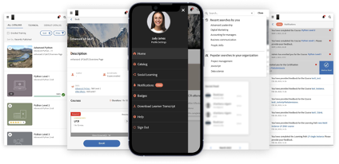

# Nyheter i den här versionen (april 2023)

## Adobe Learning Manager-app för Microsoft Teams

Den nya Adobe Learning Manager-appen på Microsoft Teams är utformad för att främja lärande i arbetsflödet och öka inlärningen i samhället. Elever kommer att kunna komma åt utbildningsinnehåll inom plattformen Microsoft Teams utan att behöva växla till en webbläsare. Kontakta din CSAM för betaversionen av Adobe Learning Manager-appen på MS Teams.

Mer information finns i [Adobe Learning Manager-app för Microsoft Teams](/help/migrated/adobe-learning-manager-app-microsoft-teams.md).

## Förbättringar av lärarledd utbildning (ILT)

Flera förbättringar har gjorts av lärarledd utbildning (ILT). Viktiga förbättringar: möjligheten att filtrera sessioner baserat på plats, möjligheten att växla instanser (VILT) utan att förlora framsteg, en ny &quot;Schemaläggningsassistent&quot; för att hantera konflikter vid bokningssessioner, möjligheten att bifoga &quot;Kompetenser&quot; till instruktörer, och välja instruktörer baserat på färdigheter.

### Vad har förändrats

* På sidan Kompetenser i appen Admin kan du överföra mappning av kompetensinstruktör.
* På sidan Kompetenser finns en ny kolumn, Instruktörer. Kolumnen visar antalet instruktörer i förhållande till kompetensen. Om du klickar på siffran i kolumnen Instruktörer omdirigeras du till ett popup-fönster som visar antalet instruktörer som har tilldelats en kompetens.

Mer information finns i [Tilldela kunskaper till instruktörer](/help/migrated/administrators/feature-summary/skills-levels.md#assign-skills-to-instructors).


### Schemaläggningsassistenten

Hantera konflikter i att boka instruktörer och klassrum eller virtuella klassrum. Om du vill veta vid vilken tidpunkt och vilket datum en instruktör är tillgänglig innan du tilldelar honom till kursen ska du använda schemaläggningsassistenten.

Författare, administratörer och anpassade administratörer/författare kan använda schemaläggningsassistenten.

Mer information finns i [Schemaläggningsassistenten](/help/migrated/authors/feature-summary/courses.md#scheduling-assistant).

## Ny Adobe Learning Manager-mobilapp

En helt ny mobilapp för Adobe Learning Manager för Android och iOS som ger elever smidig tillgång till utbildning var de än befinner sig. Appen gör det möjligt för elever att delta i utbildning på sina mobila enheter och återuppta den senare på sina datorer. Med stöd för aviseringar, filöverföringar, enkel bokmärkning och delning av utbildningsinnehåll, social utbildning med mera ger mobilappen eleverna extra flexibilitet och stöder just-in-time-utbildning.



Hämta mobilen från Google Play Butik och Apple App Store. Användare som har den äldre versionen av programmet uppmanas att hämta och installera det nya programmet.

I den här versionen har appen stöd för följande funktioner:

Den nya mobilappen stöder följande viktiga funktioner i den här versionen:

* Förbättrad sökning, inklusive visning av senaste sökningar gjorda av eleven och populära sökningar i organisationen i inmatningsrutan för sökning.
* Möjlighet att ladda ned elevens betygsutdrag.
* Improviserat meddelandecenter - ger viktiga uppdateringar till elever som meddelanden i appen
* Möjlighet att sortera och filtrera utbildningsobjekt på sidorna Katalog/Min utbildning
* Möjlighet att bokmärka utbildningsobjekt (LO:er) - bokmärkta LO:er kommer att finnas tillgängliga i avsnittet &quot;Sparat av mig&quot; på elevens startsida.
* Stöd för förbättrade LP-skivor
* Möjlighet att ändra mobilgränssnittsspråket till ett språk som stöds av Adobe Learning Manager.
* Stöd för filuppladdning i externa certifieringar, CR/VC-sessioner och aktivitetsmoduler.
* Möjlighet att skicka feedback om L1-kursen i appen.
* Stöd för djuplänkar.
* Stöd till social utbildning.
* Stöd för märken.
* Stöd för inloggning av externa användare.

**Vad stöds inte i den här versionen**

* Stöd för flera försök till en quiz-modul i en kurs när kursen tas från mobilappen.
* Sökalternativ som gör att du kan ange sökparametrar, som kursmetadata, taggar och kunskaper för att ange sökomfånget.
* Administratörsaktiverade anpassade meddelanden som visas som ett popup-fönster för användaren i mobilappen.
* Du kan inte lägga till kompetenser på kompetenssidan i programmet.
* Tar kurser offline.

Mer information finns i [Mobilappen Adobe Learning Manager](/help/migrated/learners/feature-summary/ipad-android-tablet-users.md).

## Använd valfri QR-kodskanningsapp för att skanna QR-koder för Learning Manager

Adobe Learning Manager stöder nu ett mer användarintuitivt sätt att skanna QR-koder med hjälp av den inbyggda kameraappen utan att behöva hämta ett program som skannar en QR-kod.

För att stödja det tidigare arbetsflödet, där du kunde skanna en QR-kod med ALM-appens meny, har vi i den här versionen tillhandahållit information om hur du byter till det nya arbetsflödet.

Med förbättringar av QR-kodbaserade arbetsflöden stöds inte längre gamla QR-koder som genererades före den här versionen. Därför måste du generera en ny QR-kod om du har genererat en äldre version av Learning Manager för en klassrums- eller VC-session som genomförs efter den här versionen.

### Förbättringar av rekommendationsmeddelanden

I den här versionen har vi uppdaterat rekommendationsremsan från en organisation till en rekommendation baserad på användargruppen, som eleven ingår i, för att visa relevanta kurser för eleven.

Administratörer kan rikta vissa kurser eller utbildningar till elever baserat på elevernas profiler. Eleverna kan sedan söka efter kurser baserat på profilen de ingår i.

**Vad har förändrats**

Det finns ett alternativ på meddelandesidan som visar en elev varför denna kurs eller utbildning rekommenderades till dem.


### Ny administratörsinställning

Administratören har ett nytt alternativ som heter Grupper i Inställningar > Visa filterpaneler. När Grupper är aktiverat visas filtret Grupper på elevens startsida. Eleven kan sedan välja att visa kurserna baserat på användargrupperna.

|   | När alternativet är aktiverat | När alternativet är inaktiverat |
|--- |--- |--- |
| Alternativet Grupper är aktiverat | <ul><li> Visar användargruppen på panelen tillsammans med länken till katalogsidan.</li><li> Användargruppen visas i katalogfiltret.</li></ul> | <ul><li>Namnet på användargruppen visas inte på panelen.</li><li>Användargruppen visas inte i katalogfiltret.</li></ul> |
| Alternativet Grupper är inaktiverat | <ul><li>Visar namnet på användargruppen på kurspanelen som oformaterad text.</li><li>Användargruppen visas inte i katalogfiltret.</li></ul> | <ul><li>Kurspanelen visar inte texten eller namnet på användargruppen.</li><li>Användargruppen visas inte i katalogfiltret.</li></ul> |

**Så här fungerar det**

Administratören skapar ett meddelande genom att lägga till kursen för valfri användargrupp och publicerar det.

Vad en elev ser är en remsa med rekommenderade kurser på hemsidan, och en länk till kursen på plattan.


När eleven klickar på länken eller knappen Gå till katalog omdirigeras eleven till kurskatalogsidan. Eleven visar sedan listan med användargrupper som ska filtreras baserat på användargrupperna i katalogen och sidan Min utbildning.


## Sök sessioner med hjälp av platser

### Hantera klassrumsplatser

Ibland vill du att en elev filtrerar en session i kalendern baserat på plats. Efter att ha lagt till en plats med hjälp av dialogrutan Klassrumsplatser eller CSV-filen kan eleven sedan filtrera.


Mer information finns i [Lägg till klassrumsplatser](/help/migrated/administrators/feature-summary/settings.md#classroom-locations).

### Kalenderwidget

En elev kan filtrera sessioner som har tilldelats dig efter plats. Gå till kalenderwidgeten, välj Filtrera sessioner och välj plats.


Utbildningsplatsen visas nu på sidan Kursöversikt om platsen läggs till av författaren när kursen skapas.

### Administratör

Du som är administratör kan kontrollera om en elev kan filtrera kurser efter plats. Aktivera eller inaktivera utbildningsplatser i Inställningar > Allmänt.

Mer information finns i [Administratörsinställningar](/help/migrated/administrators/feature-summary/settings.md).

## Ändringar i testversionsupplevelsen

När testkontot har skapats blir kurserna i Content Marketplace tillgängliga utan dröjsmål.

## Chatbot

Chatta med en eller flera agenter med en chattrobot. Endast administratörer och anpassade administratörer av testversionskonton kan använda den här funktionen.

Chattroboten kommer att:

* Välkommen med ett meddelande.
* Ange alternativ för produktinformation eller en produktdemonstration.
* Överför chatten till en agent.
* Bevara din chatthistorik.


## Förbättringar av checklistan för observationer

Författare kan nu välja Hanterare och Butik/Platshanterare som granskare för checklistor. Chefer och hanterare för butiker/platser, om de väljs som granskare, kan också visa och slutföra checklistorna för sina team utan att behöva växla till instruktörsroller. Instruktörer fortsätter att granska checklistor. Ett nytt &quot;Granska checklista&quot;-meddelande skickas till granskarna (instruktörer/chefer) för en instans för checklistan för registreringar.

Om en chef läggs till som granskare i checklistmodulen kan hen granska checklistan i chefsappen. Instruktörerna ska fortsätta att se över checklistan som förväntat.

Mer information finns i [Checklista för observation](/help/migrated/authors/feature-summary/courses.md#observation-checklist).

## Andra förbättringar

### Elevsökning

Sökresultaten är även kategoriserade som:

* Senaste sökningar utförda av dig
* Populära sökningar i din organisation

Sökfunktionen har även förbättrats för elever. Elever kan nu använda dubbla citattecken, plus operatorerna &quot;+&quot; och &quot;-&quot; för att hitta relevanta resultat snabbare och få en sökliknande upplevelse i Google.

* Använd dubbla citattecken (&quot;...&quot;) för att söka efter kurser som innehåller den exakta frasen eller ordet. Om du till exempel skriver &quot;datavetenskap&quot; returneras kurser som börjar med frasen datavetenskap.
* Använd + -operatorn för att säkerställa att endast de resultat som innehåller den specifika frasen eller ordet visas. Till exempel, Datorprogrammering + python kommer att visa endast de datorprogrammering kurser som innehåller ordet &quot;python&quot;.
* Använd operatorn - för att säkerställa att endast de resultat som inte innehåller den specifika frasen eller ordet visas. Till exempel, datorprogrammering -python kommer att visa alla datorprogrammering kurser utom de som innehåller ordet &quot;python&quot;.

### Popup-fönster i konflikt för utbildningsobjekt

På sidan Översikt visas ett popup-fönster vid registrering när en elev har sessioner i konflikt. Om registrering från katalogsidan eller översiktssidan och en elev redan har sessioner i konflikt, kommer det att utlösa ett popup-fönster med sessionsdetaljer i konflikt. Även om en elev har en session i konflikt kan hen registrera sig för den nya sessionen.


Observera att det här meddelandet bara är en varning. Du kan fortfarande registrera dig för en kurs.

### Ny mall

Vi har lagt till en ny e-postmall som heter Session avbruten på grund av avregistrering. När en användare avregistreras från en utbildning får hen e-postmeddelandet om avbeställningen.

### Ny prisfunktion för kurser

Administratörer kan nu ange valutan för kontot i avsnittet Administratörsinställningar > Grundläggande information. Administratörer kan ange både symbolen och ISO-valutakoden, till exempel USD, GBP och så vidare. Standard för alla nya konton är $. Den här ändringen gäller endast appar som inte är elevappar. Administratörer kan se ändringen när de förhandsgranskar kursen som elever. Valutasymbolen visas även i Elevens betygsutdrag och Utbildningsrapporter.

Mer information finns i [Administratörsinställningar](/help/migrated/administrators/feature-summary/settings.md).

### Växla instanser

En elev som är registrerad för en viss instans av en kurs kan visa en lista över alla tillgängliga instanser av kursen och växla till en annan instans som fungerar bättre för dem. Anledningen till bytet kan vara att eleven missade att närvara vid den föregående instansen, eller att sessionstidpunkten för den nya instansen är lämpligare eller kan vara något annat.

Alla framsteg som görs av eleven som en del av kursen, elevquizpoäng etc., överförs till den nya instansen. Den här funktionen är främst avsedd för klassrumskurser och blandade kurser, men vi stöder alla typer av kurser, inklusive kurser i egen takt.

Alternativet Visa alla förekomster visas oavsett förekomstväxlingsinställningarna. Elever kommer nu att se ett alternativ för att visa alla instanser om det finns mer än en instans av en kurs.

Om alternativet Instansväxling är aktiverad kan eleverna växla till olika instanser tills de har slutfört kursen. Om alternativet är inaktiverat kan elever visa instanserna men kan inte registrera sig för kursen.

När eleven väljer **Visa alla instanser** kan eleven se alla kursinstanser.


En administratör kan växla instanserna för elever.


Du kan inte växla instanser förrän någon instans av kursen har slutförts från eleven eller administratörsappen.

Författare som skapar en kurs kan växla mellan att aktivera eller inaktivera instansväxling. Instansväxling är endast tillgänglig för kostnadsfria kurser.

Mer information finns i [Instanskonfiguration](/help/migrated/authors/feature-summary/courses.md).

**Elever**

Elever kan växla från en kursinstans på väntelistan till en annan instans. De kan också byta kursinstans i en utbildningsväg eller certifiering.

Efter att ha registrerat sig till utbildningsvägen eller certifieringen kan de på kurssidan klicka på Visa instanser och sedan växla en instans.

>[!NOTE]
>
>Konfigurationen av instansväxel stöds inte för de av hanteraren nominerade registreringstyperna.
>
>Om du byter instans från en Flex LP överförs förloppet till den andra instansen.

### Verifieringskedja för användare

Verifieringskedjan för användare samlar information om elever som växlade instanser, &quot;från instans&quot; till &quot;instans&quot;, växlade efter tid, datum osv.


Mer information finns i [Verifieringskedjan för användare - rapport](/help/migrated/administrators/feature-summary/reports.md#useraudittrailreports).

### Rapport över instruktörsanvändning

Den här rapporten visar den tid (i minuter) som en instruktör tilldelar sessioner varje dag. Rapporten kan laddas ned under tre månader från det valda startdatumet.

Mer information finns i [Rapport över instruktörsanvändning](/help/migrated/administrators/feature-summary/reports.md#instructor-utilization-report).


### Rapport om arbetsstöd

En ny rapport för att hålla reda på de arbetsstöd som finns i kontot och olika information om arbetsstöd, såsom språk, typ, varaktighet, författare, taggar och så vidare.

Mer information finns i [Registreringsrapport för arbetsstöd](/help/migrated/administrators/feature-summary/reports.md).

### Riktade ad hoc-e-postmeddelanden till elever som är registrerade i en viss kursinstans

Administratörer och författare kommer att kunna skicka riktade ad hoc-meddelanden via e-post till elever som har registrerat sig för en viss instans av en kurs. Alternativet att skicka e-postmeddelanden på instansnivå har lagts till för kurser och utbildningsprogram.


*Skicka e-postmeddelanden på instansnivå*

I dialogrutan Skapa meddelande är alternativet Typ som E-post och Utbildning, tillsammans med instans, markerat som standard. Ange ämne, skriv meddelandet och klicka på Spara.

Mer information finns i [E-postmeddelanden på instansnivå](/help/migrated/administrators/feature-summary/courses.md#send-instance-level-emails).

### Riktade ad hoc-e-postmeddelanden till elever via meddelanden från administratören

För administratörer har en ny typ av meddelande - &quot;Som e-post&quot; lagts till. Det här kan användas för att skicka riktade ad hoc-e-postmeddelanden till elever i en vald användargrupp eller till elever som har registrerat sig för specifik utbildning.

Anpassad administratör och författare kan också visa det här alternativet på instansnivå om de har den åtkomst som krävs.

Mer information finns i [Meddelanden](/help/migrated/administrators/feature-summary/announcements.md#as-email).

### Nya e-postmallar

I den här versionen har vi lagt till e-postmallar för chefer på överhoppad nivå. Mallarna är avsedda för när chefer får e-postmeddelanden om att deras rapporter på andra nivån saknar någon kurs, utbildningsväg eller tidsgränser för certifiering. Dessutom får de e-postmeddelanden när deras rapporter på andra nivån närmar sig eventuella deadlines för slutförande av kurser, utbildningsvägar eller certifieringar.

* Hoppa över eskalering av nivå för slutförande av kurs - före deadline
* Hoppa över eskalering av nivå för missad deadline för kurs
* Hoppa över eskalering på nivå för slutförande av utbildningsväg - före deadline
* Hoppa över eskalering av nivå för missad deadline för utbildningsväg
* Hoppa över nivåeskalering för slutförande av certifiering - före deadline
* Hoppa över eskalering av nivå för missad deadline för certifiering

Alternativen är aktiverade som standard.

## API-ändringar i den här versionen

### Nya rapporter

Vi har lagt till ett nytt attribut, jobType, i jobb-API:et. Attributet accepterar följande värden:

* **generateInstructorUtilisationReport**: Returnerar en instruktörs användningsrapport.
* **generateJobAidMetadataReport**: Returnerar metadata för en arbetsstödsrapport.

**Slutpunkt**: POST /primeapi/v2/jobs

generateJobAidMetadataReport-begäran:

```javascript {line-numbers="true"}
{ 
    "data": { 
        "type": "job", 
            "attributes": { 
                "description": "description of your choice", 
                "jobType": "generateJobAidMetadataReport" 
            } 
    }
} 
```

svar på generateJobAidMetadataReport:

```javascript {line-numbers="true"}
{ 
  "links": { 
    "self": "https://learningmanagerstage1.adobe.com/primeapi/v2/jobs" 
  }, 
  "data": { 
    "id": "31126", 
    "type": "job", 
    "attributes": { 
      "dateCreated": "2023-02-28T18:36:48.000Z", 
      "description": "description of your choice", 
      "jobType": "generateJobAidMetadataReport", 
      "status": { 
        "code": "Submitted" 
      } 
    } 
  } 
} 
```

generateInstructorUtilisationReport-begäran:

```javascript {line-numbers="true"}
{
    "data": { 
        "type": "job", 
            "attributes": { 
                "description": "description of your choice", 
                "jobType": "generateInstructorUtilisationReport", 
                "payload": { 
                    "year": "2023", 
                    "month": "2" 
                } 
            } 
    } 
}
```

generateInstructorUtilisationReport-svar:

```javascript {line-numbers="true"}
{ 
  "links": { 
    "self": "https://learningmanagerstage1.adobe.com/primeapi/v2/jobs" 
  }, 
  "data": { 
    "id": "31130", 
    "type": "job", 
    "attributes": { 
      "dateCreated": "2023-02-28T18:43:43.000Z", 
      "description": "description of your choice", 
      "jobType": "generateInstructorUtilisationReport", 
      "payload": { 
        "month": "2", 
        "year": "2023" 
      }, 
      "status": { 
        "code": "Submitted" 
      } 
    } 
} 
} 
```

Mer information finns i [API-referensdokument](https://captivateprime.adobe.com/docs/primeapi/v2/).

### Byte av elevinstans

Med Registrering av elev-API kommer du åt alla tillgängliga instanser och kan växla till en annan instans av en kurs. Den nya instansen ärver alla egenskaper från den föregående kursen.

Vi har lagt till en ny frågeparameter, enrollmentID, som informationen begärs för.

>[!NOTE]
>
>Texten krävs bara för följande scenarier:
>
>1. Flexibel utbildningsplan
>1. Byte av kursinstans

### Konton

Svaret innehåller ett nytt attribut, currencyCode.

**Slutpunkt**: GET /primeapi/v2/account

### Kompetens- och kompetensnivåassociering för instruktörer

Vi har introducerat en ny funktion som fångar instruktörernas kompetens expertis, d.v.s. för varje instruktör bibehålls deras expertis och detta kan göras tillgängligt för åtgärder nedströms som sökning och filtrering.

Följande attribut ska läggas till:

* InstructorSkills
* InstructorSkillLevel

**Slutpunkt**: GET /primeapi/v2/account /&lt;account_id>/instruktörskompetens/search

### ILT-ändringar

| Beskrivning | Ny parameter/nytt svar | Slutpunkt |
|--- |--- |--- |
| Lista alla städer | filter.cityName=true/false | GET /primeapi/v2/data |
| Sök efter och filtrera städer | filter.cityName=city_name<br>Har även stöd för en kommaavgränsad lista med städer |
| GET /primeapi/v2/search |
| Information om returrum | include=room | GET /primeapi/v2/users/`<id>`/kalender |
| Utbildningsobjekt för att filtrera städer | filter.cityName=city_name <br> Det finns även stöd för en kommaavgränsad lista med städer. | GET /primeapi/v2/learningObjects |
| Lägg till stadspanel | Svaret innehåller ett nytt attribut, filterPanelSetting=true/false. | GET /primeapi/v2/account |

### Elevsessioner som har en konflikt

Hämta en lista över alla sessioner som står i konflikt för en instans.

Vi har lagt till följande fält:

* loID
* loInstanceID

**Slutpunkt**: `GET /primeapi/v2/learningObjects/{loId}/instances/loInstanceId/conflictingSessions?page[offset]=0&page[limit]=10`

### Klassrum i VC

Utför platsbaserad sökning efter VC-kurser. Ett nytt attribut, roomLocation, finns i resursmodellen för att ange den frihandsplats som angavs när en VC-kurs skapades.

Vi har gjort följande ändringar:

**LO**

En ny frågeparameter, filter.loFormat=Virtual Classroom för learningObjects API.

**Slutpunkt**: GET /primeapi/v2/learningObjects

**Kalender**

En ny frågeparameter, filter.allSessions=false, för kalender-API:t. Standardvärdet för parametern är false. Om värdet är true returneras alla kalendersessioner för en elev.

**Slutpunkt**: `GET /primeapi/v2/users/<id>/calendar?filter.allSessions=false`

### Sökhistorik för elev

**Search**

En ny frågeparameter, persistsSearchHistory. Standardvärdet är true, som behåller frågan om sökförslagen.

**Slutpunkt**: GET /primeapi/v2/search?persistSearchHistory=true

**Förslag**

En ny frågeparameter, suggestionsType. Följande värden godtas:

* learnerHistory (standard)
* accountHistory

**Slutpunkt**: GET /primeapi/v2/search/suggestions/?suggestionsType=learnerHistory

### Filtrering av användargrupper

Utbildningsobjekt och sök-API:er tillhandahåller filter för att hämta alla utbildningsobjekt som tillhör användargruppen via angivna filter. API:erna har stöd för filter som en kommaavgränsad lista.

Vi har tillhandahållit ett nytt filter, filter.lo.announcementGroups, för att hämta alla LO:er som tillhör de angivna användargruppsfiltren.

Det kan vara en kommaavgränsad lista med flera värden för flexibilitet, och bearbetningen ska baseras på OR-åtgärden mellan de flera grupperna. t.ex. hämta alla LO:er som faller under de givna användargrupperna.

### Anpassad grupp

Du kan lägga till och ta bort externa användare till och från anpassade grupper via API.

**POST**

POST /userGroups/{id}/users

**Text**

```javascript {line-numbers="true"}
"data": [ 
     { 
           "type": "user",  
           "id": "{id}"   
     }  
]  
```

**DELETE**

DELETE /userGroups/{id}/users

**Text**

```javascript {line-numbers="true"}
"data": [  
     {  
          "type": "user",  
           "id": "11218291"  
     }  
]   
```

### Meddelandeanvändargruppsfiltrering för förluster i elevappen

* GETEN /användare/{userId}API:t för /userGroups har en ny parameter, filter.announcementGroupsOnly, som tar ett booleskt värde (true/false). Detta filtrerar endast användargrupper som administratören meddelar. Standardvärdet för den här parametern är false.
* GET /learningObjects API har en ny parameter, filter.announcementGroups, som accepterar meddelandegrupp-ID:n för att filtrera resultat.
* API:t för GET/sökning har en ny parameter, filter.announcementGroups, som accepterar meddelandegrupp-ID:n för att filtrera resultat.

Exempel på svar nedan:

```javascript {line-numbers="true"}
{
  "links": {
    "self": "https://learningmanagerstage1.adobe.com/primeapi/v2/recommendations?page[offset]=0&page[limit]=10&strip=1&filter.recType=announcement&filter.loTypes=course"
  },
  "data": [
    {
      "id": "course:5836866_10855885_recommendation",
      "type": "recommendation",
      "attributes": {
        "reason": [
          "Based on your Group - UGforAnnouncement"
        ],
        "reasonModel": [
          {
            "modelId": 1781592,
            "modelType": "userGroup",
            "modelValues": {
              "group_name": "UGforAnnouncement"
            },
            "template": "Based on your Group - {{group_name}}"
          }
        ]
      },
      "relationships": {
        "learningObject": {
          "data": {
            "id": "course:5836866",
            "type": "learningObject"
          }
        }
      }
    },
    {
      "id": "course:7013328_10855885_recommendation",
      "type": "recommendation",
      "attributes": {
        "reason": [
          "Based on your Group - All Learners"
        ],
        "reasonModel": [
          {
            "modelId": 1410724,
            "modelType": "userGroup",
            "modelValues": {
              "group_name": "All Learners"
            },
            "template": "Based on your Group - {{group_name}}"
          }
        ]
      },
      "relationships": {
        "learningObject": {
          "data": {
            "id": "course:7013328",
            "type": "learningObject"
          }
        }
      }
    },
    {
      "id": "course:6408989_10855885_recommendation",
      "type": "recommendation",
      "attributes": {},
      "relationships": {
        "learningObject": {
          "data": {
            "id": "course:6408989",
            "type": "learningObject"
          }
        }
      }
    },
    {
      "id": "course:6409761_10855885_recommendation",
      "type": "recommendation",
      "attributes": {},
      "relationships": {
        "learningObject": {
          "data": {
            "id": "course:6409761",
            "type": "learningObject"
          }
        }
      }
    },
    {
      "id": "course:6979586_10855885_recommendation",
      "type": "recommendation",
      "attributes": {},
      "relationships": {
        "learningObject": {
          "data": {
            "id": "course:6979586",
            "type": "learningObject"
          }
        }
      }
    }
  ]
}
```

## Versionsinformation

Mer information om aktuella och tidigare versioner av Learning Manager-webbappen och enhetsappen finns i [Versionsinformation](/help/migrated/release-note/release-notes.md).

## Felkorrigeringar

Om du vill se de fel som är åtgärdade i den här uppdateringen, se [Buggar i fast lista](release-note/release-notes.md#bugs-fixed-in-this-release).

## Systemkrav

[Systemkrav för Learning Manager](/help/migrated/system-requirements.md)
