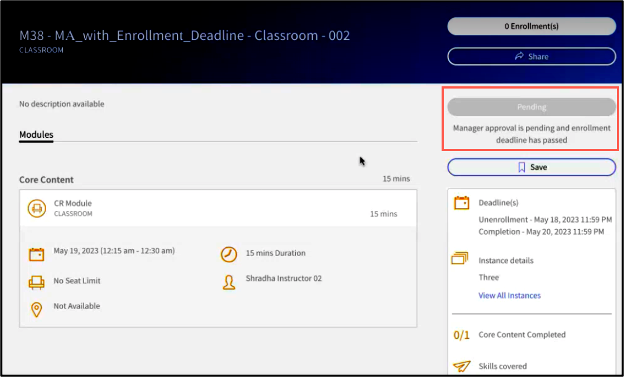

# Nyheter i den här versionen (juli 2023)

## Förbättrade rekommendationer

Adobe Learning Manager har infört ett nytt och moderniserat rekommendationssystem för kurser. Den här rekommendationsfunktionen använder AI-algoritmer och användares intressen som Produkter, Roller och Nivåer för att ge personliga innehållsrekommendationer.

Mer information finns i [Recommendations i Adobe Learning Manager](recommendations-adobe-learning-manager.md).

## Flera registreringar

I den här versionen av Adobe Learning Manager introducerar vi flerregistrering för elever som gör att de kan registrera sig för mer än en instans av en kurs vid en eller flera tidsperioder.

Mer information finns i [Flera registreringar](/help/migrated/authors/feature-summary/courses.md).

### Flerregistreringar i mobilapp eller på djupet

Elever kan inte registrera sig i flera instanser från en mobilapp/immersiv. Flerregistrering stöds inte i mobilappen och på en uppslukande mobilwebbplats.

>[!NOTE]
>
>Om du aktiverar multiregistrering läggs flera rader till i elevens betygsrapport för varje kurs (en rad för varje instans).
>
>Om du har ställt in rapporteringsautomatisering som endast förutser en rad per kurs måste du göra de nödvändiga justeringarna av rapporteringsautomatiseringen innan du aktiverar funktionen Flerregistrering.

### Format för utmärkelsetecken i en flerregistrerad instans

För att stödja märken i en flerregistrerad instans ändras märkesformatet till `userId_badgeId_COURSE_courseId_courseInstanceId`.

### Starta spelare i flera registreringar med ett fjärradministrerat läge

I den här versionen har vi ändrat biblioteket som används för kommunikation med den headless-spelaren.

Vid multiregistrering måste du skicka argumenten som är omslutna i ett objekt.

```
{{startplayer(argument_object) ,
where
argument_object=
{ loId = <loId>, accountId = <accountId>, userId =<userId>, accessToken = <accessToken>, domId = <elementId>, onModuleLoaded = fn(), isMultiEnrolled=<boolean>, instanceId=<instanceId> }
}}
```

## Borttagning av exavaultanslutning

Denna version av Adobe Learning Manager kommer att innehålla en ny anslutning som kommer att använda AWS Transfer familjs SFTP-protokoll.

Den här ändringen kommer även att ersätta ExaVault-anslutningen, som inte längre kommer att vara tillgänglig för nya användare. Du kan använda en FTP-klient med öppen källkod som ersättning för ExaVault. Mer information finns i [Övergång från FTP-hanteraren i Adobe](transition-from-ftp-manager.md).

## Påminnelser i Outlook för klassrumssessioner och virtuella sessioner

Klassrums- och virtuella klassrumssessioner som har skapats från Adobe Learning Manager och har lagts till i elevens Outlook-kalender stöder nu påminnelser från Outlook konsekvent (på liknande sätt som mötespåminnelser i Outlook).

## Förbättringar av tilldelning av kunskaper till kurser

Vi har förbättrat arbetsflödet för kompetenstilldelning för författare. Listan Kompetensförslag på sidan Kursinställningar innehåller nu en sökfunktion för skrivhuvudet. Författare kan nu söka efter kompetenser genom att skriva de första tecknen, och förslag visas i listrutan Kompetens baserat på indata. Med den här förbättringen behöver författare inte bläddra igenom hela listan för att hitta och tilldela kunskaper till kurser.

## Förbättringar av arbetsflöde för kurser som godkänts av chef

Chefsgodkända kurser ger nu lämplig felinformation till både chefer och elever.



Chefer kan nu visa relevanta felmeddelanden med information (till exempel att registreringens deadline har löpt ut) när de inte kan godkänna en begäran om kursregistrering. Eleverna får se felet och den korrigerande åtgärden.

## Ny utbildningsplan - rapport

Administratörer/anpassade administratörer kan nu exportera en lista över alla utbildningsplaner i kontot och metadata som status, tillämpliga användargrupper, utlösarinformation, kurser/utbildningsvägar som ingår i utbildningsplanen och påminnelseinformation.

## Rapportera för att spåra kommande utfasade instanser

Utbildningsrapporten innehåller ytterligare en kolumn som visar deadline för slutförande för instanserna i kurserna eller utbildningsvägarna så att administratörer och författare vet vilka instanser som kommer att fasas ut och kan vidta nödvändiga åtgärder.

## Förbättringar för att fånga upp kursbetyg från elever

Ett popup-fönster som fångar stjärngraderingen för en kurs visas så snart användaren har slutfört kursens sista modul.


## Anpassa e-postmallar

E-postmallar i Learning Manager innehåller nu fullt redigerbara avsnitt, vilket ger större flexibilitet att anpassa e-postkommunikation baserat på meddelande- och varumärkesinställningar.

Mer information finns i [Anpassa e-postmall](/help/migrated/administrators/feature-summary/email-templates.md#flexibility-in-customizing-the-templates).

## Förbättringar av schemaläggningsassistenten

Finjustera processen för att välja en instruktör för klassrumssessioner eller virtuella sessioner. Ett användargruppfilter har lagts till i instruktörsfältet i schemaläggningsassistenten. Författare kan nu filtrera instruktörer baserat på Instruktörsfärdigheter och eventuella ytterligare parametrar som plats, språk, beteckning och så vidare.

Mer information finns i [Filter för användargrupper i schemaläggningsassistenten](/help/migrated/authors/feature-summary/courses.md#user-group-filter).

## Förbättringar av arbetsflödet för utfasning av utbildningsobjekt

Författare kan nu tillhandahålla en **Ta bort automatiskt** datum för en kurs. Detta förebygger kataloginflation över tid och behovet av att gå tillbaka och manuellt pensionera kurserna.

Administratörer kan också på kontonivå bestämma vilken typ av åtkomst till indragna utbildningsobjekt.

Utbildningsrapporten innehåller en ny kolumn, **Datum för automatisk pensionering**, för att visa pensioneringsdatumet för varje utbildningsobjekt (om detta är inställt).

## Katalogetikettvärden av författare

Författare kan nu lägga till sina värden för katalogetiketter när de skapar eller redigerar en kurs. Administratörer kan aktivera den här funktionen på kontonivå. När en författare har lagt till ett nytt värde för katalogetiketten blir det en del av typsnittssökningen.


## Förbättringar i kurssökningen efter administratörs-, författare- och chefsroller

Sökförbättringar har gjorts för administratörs-, författare- och chefsroller. De kan nu söka med nyckelord efter titlarna. Detta gäller kurser, utbildningsvägar och certifieringar.

## Meddelanden om migreringsfel

Integreringsadministratörer meddelas via e-post om några import- eller exportåtgärder misslyckas under migreringen eller när de använder dataanslutningar som PowerBI, FTP, Box osv.

## Konfiguration med flera hanterare via API:er

Ett nytt API har lagts till i uppsättningen API:er för hanterade kontor för att stödja konfiguration av flera hanterare.

## Förbättringar av registrerings-API

Förbättringar har gjorts i registrerings-API för att stödja och optimera storskaliga massregistreringar.

## Mobilapp - visning av offlineinnehåll

Elever kan hämta och använda innehåll i offlineläge. Kapslade och flexibla utbildningsvägar stöds inte för offlinevisning.

*I den här versionen stöds endast visning av offlineinnehåll för engelskt innehåll.*

## Tillgänglighet

Flera förbättringar har implementerats för att förbättra tillgängligheten, bland annat förbättringar för att optimera läsbarheten för skärmläsare.

## Stöd för mobilappar

I nästa stora version kommer Adobe Learning Manager-mobilappen bara att stödja de tre senaste mobilversionerna av operativsystemet.

## Innehåll på LinkedIn

LinkedIn-innehåll läses inte in som förväntat i den uppslukande appen i Safari-webbläsaren. Lös problemet genom att göra så här:

1. På enheten väljer du **[!UICONTROL Settings]** > **[!UICONTROL Safari]**.
1. Inaktivera **Förhindra spårning över flera webbplatser**.
1. Inaktivera **Blockera alla cookies**.
1. Logga in på appen Immersive.
1. Spela upp innehållet.
1. Tillåt popup-fönster.

## Andra förbättringar

### Växla instanser i MS Teams

En elev kan byta till en annan kursinstans till dess att den är slutförd och behålla kursförloppet.

### Stöd för flera registreringar i MS Teams

En elev kan registrera sig i en annan kursinstans oavsett slutförandestatus i tidigare instanser. Detta gör att eleven måste registrera sig för flera instanser av samma kurs.

### Kursanteckningar stöder flera registreringar i MS Teams

Kursanteckningar finns på kursinstansnivå för att stödja multiregistrering.

## API-ändringar

Mer information om API-ändringarna finns i [API-referens för Adobe Learning Manager](https://captivateprime.adobe.com/docs/primeapi/v2/).

### API-stöd för nya rekommendationer

**GET/konto**

Returnerar om prlrecommendation är aktiverad.

**Begär**

`https://learningmanagerstage1.adobe.com/primeapi/v2/account`

**GET /data?filter.recommendationCriteria=product**

Returnerar listan med produkter/ämnen. Resultaten beror på kontoinställningar som bekräftar om alla produkter kommer att vara synliga för eleven eller katalogen som är synlig för produkter/ämnen.

**Begär**

`https://learningmanagerqe.adobe.com/primeapi/v2/data?filter.recommendationCriteria=product&filter.showAllRecommenda`

**`GET /data?filter.recommendationCriteria=role`**

Returnerar en lista med rekommenderade roller.

**Begär**

`https://learningmanagerqe.adobe.com/primeapi/v2/data?filter.recommendationCriteria=role&filter.showAllRecommendationCriteria=false`

**`GET /data?filter.recommendationCriteria=level`**

Returnerar en lista med rekommenderade roller.

**Begär**

`https://learningmanagerqe.adobe.com/primeapi/v2/data?filter.recommendationCriteria=level&filter.showAllRecommendationCriteria=false`

**POST /search/query**

Sökningen innehåller också produkter och rollparametrar i frågan. Det sker ingen förändring i fråga och text. Vi lägger till nya sorteringsalternativ

**Begär**

`https://learningmanagerstage1.adobe.com/primeapi/v2/search/query?...`

**GET /learningObjects**

Modellen för utbildningsobjekt returnerar rekommendationer som har taggats av författaren om rekommendationen för PRL är live.

**Begär URL**

`https://learningmanagerstage1.adobe.com/primeapi/v2/learningObjects?sort=recommendationScore&filter.recommendationProducts=...&filter.recommendationRoles=...&filter.excludeIgnoredRecommendations=true`

POST /learningObjects/query

Följande attribut stöds i frågeanropets brödtext:

```javascript {line-numbers="true"}
{
  "filter.announcedGroups": [
    "string"
  ],
  "filter.bookmarks": true,
  "filter.catalogIds": [
    "string"
  ],
  "filter.cityName": [
    "string"
  ],
  "filter.duration.range": [
    "string"
  ],
  "filter.effectiveModifiedDate.fromDate": "string",
  "filter.effectiveModifiedDate.toDate": "string",
  "filter.excludeIgnoredRecommendations": true,
  "filter.ignoreEnhancedLP": true,
  "filter.ignoreHigherOrderLOEnrollment": true,
  "filter.lang.subLOs": true,
  "filter.lang.twoLetterCode": true,
  "filter.learnerState": [
    "string"
  ],
  "filter.loFormat": [
    "string"
  ],
  "filter.loTypes": [
    "string"
  ],
  "filter.price": "string",
  "filter.priceRange": [
    "string"
  ],
  "filter.recommendationLevels": [
    "string"
  ],
  "filter.skill.level": [
    "string"
  ],
  "filter.skillName": [
    "string"
  ],
  "filter.tagName": [
    "string"
  ],
  "language": [
    "string"
  ],
  "preferredSortPartitionOrder": [
    "string"
  ],
  "showLoContentSource": true,
  "useCache": true,
  "filter.recommendationProducts": [
    {
      "levels": [
        "string"
      ],
      "name": "string"
    }
  ],
  "filter.recommendationRoles": [
    {
      "levels": [
        "string"
      ],
      "name": "string"
    }
  ]
}
```

**GET /recommendationProducts**

Hämtar PRL-produkt efter rekommendation Produkt-ID.

**Begär URL**

`https://learningmanagerstage1.adobe.com/primeapi/v2/recommendationProducts`

GET /recommendationRoles

Hämtar PRL-produkt efter rekommendation Produkt-ID. Endast synliga roller för (utbildningsobjekt) returneras.

**Begär URL**

`https://learningmanagerstage1.adobe.com/primeapi/v2/prlRecommendations/roles`

`POST /users/{id}/recommendationPreferences`

Skapar/återskapar (åsidosätter) inställningar för PRL-rekommendationer. Exempel på nyttolast:

```javascript {line-numbers="true"}
{
    "data": {
        "id": "userRecommendationPreferences:14755328",
        "type": "userRecommendationPreferences",
        "attributes": {
            "products": [
                {
                    "id": "recommendationProduct:1",
                    "dateCreated": "2023-05-07T20:00:00.000Z"
                },
                {
                    "id": "recommendationProduct:37",
                    "dateCreated": "2023-05-07T21:00:00.000Z"
                }
            ],
            "roles": [
                {
                    "id": "recommendationRole:23",
                    "dateCreated": "2023-05-07'T'21:00:00.000'Z'"
                },
                {
                    "id": "recommendationRole:1",
                    "dateCreated": "2023-05-07'T'20:01:00.000'Z'"
                },
                {
                    "id": "recommendationRole:2",
                    "dateCreated": "2023-05-07'T'19:02:00.000'Z'"
                },
                 {
                    "id": "recommendationRole:3",
                    "dateCreated": "2023-05-07'T'18:02:00.000'Z'"
                },
                {
                    "id": "recommendationRole:20",
                    "dateCreated": "2023-05-07'T'17:02:00.000'Z'",
                    "levels": [
                        "INTERMEDIATE"
                    ]
                }
            ]
        }
    }
}
```

**`GET /users/{id}/recommendationPreferences`**

**Begär URL**

`https://learningmanagerstage1.adobe.com/primeapi/v2//users/123/recommendationPreferences`

**`DELETE /users/{id}/recommendationPreferences`**

Tar bort användarinställningar för PRL som rekommenderas för en produkt eller roll.

**Begär URL**

`https://learningmanagerstage1.adobe.com/primeapi/v2/users/123/recommendationPreferences?ids=recommendationRole:123,recommendationRole:234`

Parametrar:

Id:n = lista över id:n som ska tas bort

**PATCH /users/{id}/recommendationPreferences**

Partiellt tillägg/uppdatering. Exempel på nyttolast:

```javascript {line-numbers="true"}
{
  "data": {
    "id": "userRecommendationPreferences:<USER_ID>",
    "type": "userRecommendationPreferences",
    "attributes": {
      "roles": [
        {
          "id": "recommendationRole:123",
          "type": "recommendationRole",
          "attributes": {
            "levels": [
              "INTERMEDIATE"
            ]
          }
        },
        {
          "id": "recommendationRole:123",
          "type": "recommendationRole",
          "attributes": {
            "levels": [
              "ADVANCED"
            ]
          }
        }
      ]
    }
  }
}
```

**POST /recommendationPreferences/learningObjects/{id}/Ignore**

Lägg till LO i blockerade rekommendationer.

**Begär URL**

`https://learningmanagerstage1.adobe.com/primeapi/v2/recommendationPreferences/learningObjects/{id}/ignored`

**`DELETE /recommendationPreferences/learningObjects/{id}/ignore`**

Tar bort LO från blockerade rekommendationer.

**Begär URL**

`https://learningmanagerstage1.adobe.com/primeapi/v2/recommendationPreferences/learningObjects/{id}/ignored`

**`GET /users/{id}/recommendationStrips`**

Hämtar alla remsor som ska användas för att visa prl-rekommendationer

### Stöd för flera registreringar för API

**GET /primeapi/v2/account**

Två nya attribut läggs till:

* instanceSwitchEnabled
* multiEnrollmentEnabled

**GET /användare/{userId}/userNotifications**

Kursinstans-ID har lagts till i meddelanden i det nya metadataattributet.

**GET /learningObjects**

I registreringsrelationen visas endast primär registrering, dvs. första registrering eller första slutförande.

**`GET /learningObjects/{id}`**

I registreringsrelationen visas endast primär registrering, dvs. första registrering eller första slutförande.

**`GET /learningObjects/{loId}/instances/{loInstanceId}`**

En ny relation läggs till i LO-instansmodellen.

**`GET /enrollments/{id}`**

Hämta registrering av flerregistrerade kurser.

**`DELETE /enrollments/{id}`**

Avregistrerar från en viss instans av utbildningsobjekt.

**POST/registreringar**

Stöder registrering i olika instanser.

**GET/registreringar**

Hämtar registreringar för endast primära registreringar för utbildningsobjektet.

**`GET /learningObjects/{id}/note`**

Hämtar en lista med anteckningar för en kurs.

**`GET /learningObjects/{lo_id}/instances/{loi_id}/note`**

Hämtar en lista med anteckningar för en kurs och instansen.

**`GET /learningObjects/{id}/resources/{loResourceId}/note`**

Hämtar en lista med anteckningar för en resurs i en kurs.

**`POST /learningObjects/{id}/resources/{loResourceId}/note`**

Lägger till en anteckning i en modul för en kurs för en viss kurs.

**`DELETE /learningObjects/{id}/resources/{loResourceId}/note/{noteId}`**

Tar bort specifika anteckningar från en viss modul mot en viss instans (del av loResource Id).

**`GET /learningObjects/{id}/resources/{loResourceId}/note/{noteId}`**

Hämtar en specifik anteckning i en modul i en kurs för en viss instans (del av loResourceId).

**`PATCH /learningObjects/{id}/resources/{loResourceId}/note/{noteId}`**

Uppdaterar specifika anteckningar från en viss modul mot en viss instans (del av loResource Id).

**Ändringar i administratörs-API**

* GET /användare/{id}/enrollments
* POST /users/{id}/enrollments
* DELETE /users/{id}/enrollments/{enrollmentId}
* PATCH /users/{id}/enrollments/{enrollmentId}

### Framtvingade fält för slutpunkter

Produkter och roller läses bara in när de används.

Exempelbegäran

* GET `https://learningmanagerstage1.adobe.com/primeapi/v2/learningObjects/course%3A7418798?enforcedFields[learningObject]=products`
* GET `https://learningmanagerstage1.adobe.com/primeapi/v2/users/11255638/userBadges?include=model&page[offset]=0&page[limit]=10&sort=dateAchieved&enforcedFields[learningObject]=products,roles`

### Ändringar av API för sökning och ordstamsimplementering (engelska)

Ordstam är processen att reducera ett ord till dess grundform. Detta garanterar att ordmatchningar görs i olika varianter under en sökning. Till exempel kan promenader och promenader stammas till samma rotord: promenad. När de ordstammade skulle en förekomst av något av orden matcha det andra i en sökning.

I den här versionen har vi lagt till ordstam för engelska språk, som omfattar följande varianter - en_US, en_AU, en_GB.

Attributet ordstamsigenkänning anger om ordstamsigenkänning krävs i sökresultaten. Detta är som standard inställt på Falskt

### Borttagning av V1-slutpunkter

V1 API:er slutar fungera i den här versionen. Mer information finns i [Användarhandbok för utvecklare](/help/migrated/integration-admin/feature-summary/developer-manual.md).

### Meddelanden om registrering eller avregistrering från kurs

Den här versionen introducerar stöd för kursinstans-ID med meddelanden i det nya metadataattributet.

### Stöd för L1-feedback

Gör det möjligt för eleven att ge feedback på varje instansnivå av funktionen för flera registreringar.

**API:** `POST /enrollments/{id}/l1Feedback`

### LO tvingad fältlista

I den här versionen måste du skicka avsnitt, prequisiteConstraints, equipsiteLOs, subLOs, additionalResources, additionalLOs, instanser, catalogLabels till learningObject uttryckligen.

Exempel:

`enforcedFields[learningObject]=prerequisiteLOs,instances`

### Meddelande om utfasning för nästa version

* Åsidosättningsflagga för elevens API:er.
* Vi ändrar standard för highlightResults=false. Vi ändrar också standardvärdet för snippetType=courseName.
* Vi tar bort matchType=bool i sökslutpunkten.
* autoCompleteMode har följande [Inaktuell] och för att ge samma funktioner som autoCompleteMode =false har vi lagt till en matchType som heter Match.

### ID-format för utmärkelsetecken med flera registreringar

För att stödja flerregistrerade instansmärken ändrar vi formatet för kursmärken från `userId_badgeId_COURSE_courseId to userId_badgeId_COURSE_courseId_courseInstanceId` för att unikt identifiera märken.

## Versionsinformation

Mer information om aktuella och tidigare versioner av Learning Manager-webbappen och enhetsappen finns i [Versionsinformation](/help/migrated/release-note/release-notes.md).

## Kända problem eller begränsningar i den här versionen

Följande begränsningar finns i den här versionen:

### Visa offlineinnehåll i mobilappen

Följande stöds inte när offlineinnehåll visas i appen:

* Flex-kurser, utbildningsplaner eller certifieringar.
* Förbättrade kurser, utbildningsplaner eller certifieringar.
* Flera quiz-aktiverade kurser, utbildningsplaner eller certifieringar.
* Harvard Manage Mentor, Content Marketplace, GetAbstract eller LinkedIn-kurser, utbildningsplaner eller certifieringar.
* Utbildningsplaner och certifikat med aktiverade förhandskrav.
* Utfasade kurser, utbildningsplaner eller certifieringar.
* Kurser, utbildningsplaner eller certifieringar vars deadline har löpt ut.
* Externa certifikat.
* e-handelsaktiverade kurser, utbildningsplaner eller certifieringar.

Följande utbildningsvägar, kurser eller certifieringar har några problem med offlinesynkronisering:

* Alla utbildningsvägar.
* Alla interna certifikat.
* Innehåll med POST-samtal.

### Recommendations

Följande stöds inte för produkt/roll/nivå i det nya rekommendationssystemet:

* Adobe Experience Manager, Teams, SFDC och icke-inloggad.
* Mobilappen stöder inte redigering av produkter och roller på rekommendationssidan.
* Mappningen är inte möjlig under migreringen.
* Tagga LinkedIn, Content Marketplace och andra externa kurser, utbildningsplaner eller certifieringar automatiskt.
* Återgår till kunskapsbaserad eller klassisk efter publicering.
* Sökmenyn för produkter och roller i elevappen.
* Massmappning av kurser, utbildningsplaner eller certifieringar och användare i Admin-programmet.

## Systemkrav

[Systemkrav för Learning Manager](/help/migrated/system-requirements.md)
