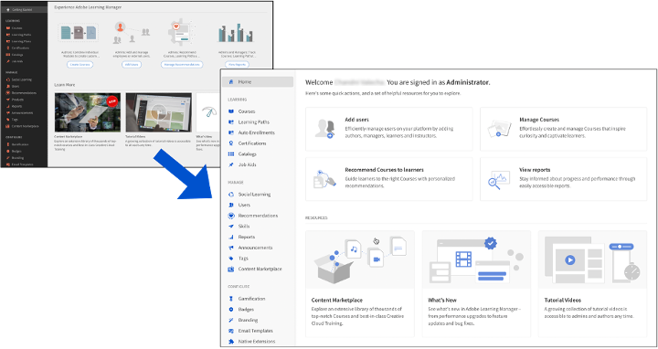

# Nyheter i den här versionen

## Moderniserat användargränssnitt

Användargränssnittet i Adobe Learning Manager har uppdaterats en hel del för att ge dig en renare och modernare upplevelse. Landningssidorna för administratörs- och författarrollerna har förnyats och gränssnittstemauppdateringar har gjorts för alla roller. Inga ändringar har dock gjorts av placeringen av menyer, knappar eller länkar, och du hittar dem exakt där de fanns tidigare.

Temauppdateringarna tillämpas automatiskt på konton som använder standardtemat. Uppdateringarna av användargränssnittstemat påverkar inte konton som har gjort ändringar för att använda ett anpassat tema. Sådana konton måste växla tillbaka till standardtemat för att få de nya temauppdateringarna.

*Moderniserat användargränssnitt för Adobe Learning Manager*

### Om den här ändringen

**Vilka ändringar finns i den här versionen?**

Det finns en ny mall i sidhuvudet som automatiskt ändrar storlek på logotypen till en fast storlek och position samtidigt som logotypens proportioner behålls. Ändringen syftar till att förbättra elevupplevelsens visuella lockelse.

Organisationens namn i rubriken ändrar också automatiskt storlek till 336 (minimum) x 680 (maximum) px för elever.

**Vilken är den rekommenderade storleken på logotypen?**

Logotypens maximala bredd är 210 px. Logotyper med en bredd på mer än 210 px eller en höjd på mer än 42 px har ändrat storlek till 42 x 210 px.

Om logotypstorleken är mindre än den rekommenderade storleken överförs logotypen utan någon ändring och är centrerad.

**Hur påverkar det?**

Företagsnamn som inte är längre beskärs och en ellips fyller utrymmet.

**Vad rekommenderar vi?**

* Ändra storlek på bilden så att proportionerna behålls. Rekommenderad maximal logotypstorlek är 42 px (vertikalt) x 210 px (horisontellt).
* För många konton gäller detta automatiskt; ingen ändring krävs.

## Inbyggd utbyggbarhet

Skapa anpassade upplevelser i den inbyggda versionen av Adobe Learning Manager, så att du inte kan använda headless för enklare fall. Du kan också skapa anpassade program och placera dem på olika platser i den ursprungliga versionen av arbetsflödena för elev, chef, administratör, författare eller instruktör.

En elev kan använda ett specialbyggt program eller tillägg, som en administratör har skapat.

Visa [Inbyggd utbyggbarhet](/help/migrated/administrators/feature-summary/native-extensibility.md) om du vill veta mer.

## Verktyget Quiz-skapande

Du kan nu skapa utvärderingar i Learning Manager med det nya verktyget för att skapa quiz på sidan Innehållsbibliotek. De utvärderingar som skapas blir en del av innehållsbiblioteket och kan läggas till i en &quot;gemensam&quot; mapp för återanvändning av kurser.

Visa [Skapa ett quiz](/help/migrated/authors/feature-summary/content-library.md) om du vill veta mer.

## Rapportera ändringar i den här versionen

### Rapport över ändringar i anmälan till arbetsstöd

I tidigare versioner av Adobe Learning Manager hade registreringsrapporten för arbetsstöd inga filter. Adobe Learning Manager hämtade alla data för ett konto.

I den här versionen har vi lagt till en listruta i dialogrutan Arbetsstödsrapport.

### Ändringar i aviseringsrapporten

I tidigare versioner av Adobe Learning Manager saknades filter för meddelanderapporten. Adobe Learning Manager har hämtat alla aviseringar på kontot.

I den här versionen har vi lagt till ett datumfilter som du kan använda för att hämta meddelandena inom en angiven period.  Du kan dock bara hämta rapporten för de senaste sex månaderna.

### Ändringar i kursrevideringsdata i registreringsrapport

I den här versionen kan du hämta kursrevideringsinformationen i en registreringsrapport genom att ange en tid. Nedladdningsperioden kommer att begränsas till sex månader för konton med mer än fem miljoner registreringar. För alla andra konton kommer perioden att vara 15 månader.

Du kan hämta rapporten från **[!UICONTROL Reports]** > **[!UICONTROL Custom Reports]** > **[!UICONTROL Historic Reports]** > **[!UICONTROL Course Access Report]**.

### Ändringar i elevens betygsutdrag

I tidigare versioner av Adobe Learning Manager fanns de borttagna användarna om en anpassad administratör hade en användaromfattning. I den här versionen kommer utbildningsbeviset att innehålla de borttagna användarna om den anpassade administratören antingen har användaromfånget eller åtkomst till alla användargrupper.

### Ändringar i närvarorapport

Närvarorapporten på närvarosidan för kurserna i appen Admin och på sidan Sessionselever i appen Instruktör används för att hämtas synkront. I den här versionen hämtas den här rapporten asynkront via ett meddelande.

Mer information om rapporter finns i [Rapporter](/help/migrated/administrators/feature-summary/reports.md) i Adobe Learning Manager.

## Avveckling av Content Marketplace

Kurser som har upphört att gälla i katalogen Importerat innehåll Marketplace (Enterprise-utbildning) raderas automatiskt när de löper ut. Kurserna kommer att ställas in på att tas ur bruk när innehållet markeras för avveckling. Befintliga registrerade elever kan konsumera dem inom en begränsad tidsram efter vilken de tas bort. Detta håller katalogen ren och visar inte användare utgångna kurser.

## Kompetensbaserade nya rekommendationer

Adobe Learning Manager förbättrar rekommendationerna för kund- och partneraktiverade konton. Denna förbättring av rekommendationsalgoritmen med ändringen av rangordningsalgoritmen för kurs, utbildningsväg och certifiering ger en bättre användarupplevelse vid innehållsidentifiering.

Algoritmen tillåter inte längre peer-baserade rekommendationer. Ändringen påverkar inte de befintliga användarna, men alternativet Branschjusterad finns kvar. För alternativet Anpassad tillåter Adobe Learning Manager inte längre anpassat peer-baserat val.

Den kollegiala gruppen blir nu ett konto, och eleverna ser en sträng som visar de populära ämnena i gruppen. Alla rekommendationer är förklarliga. Om du till exempel visar något i ett ämne kommer kortet på remsan att visa orsaken till kursen.

## Förbättringar av anpassat administratörsarbetsflöde

Anpassade administratörer har nu mer paritet med administratörsroller när det gäller åtkomst till rapporter. Administratörer kommer att kunna konfigurera rapporteringsåtkomst med bättre kontroll.

I Adobe Learning Manager är endast betygsutdrag för inlärning och spelifiering tillgängliga för en anpassad administratör. I den här versionen kan en anpassad administratör få åtkomst till alla anpassade rapporter utom xAPI- och e-postrapporter, som fortfarande bara är tillgängliga för administratören. Åtkomsten till alla rapporter regleras av den katalog och det användaromfång som den anpassade administratören har. Det finns få rapporter som bara är tillgängliga med full omfattning. De är:

<table>
    <tbody>
        <tr>
            <td>
    
<b>Rapportera</b>
</td>
   <td>
    
<b>Tillgänglig</b>
</td>
   <td>
    
<b>Omfång</b>
</td>
        </tr>
    <tr>
   <td>
    
Verifieringskedja för innehåll
</td>
   <td>
    
Ja
</td>
   <td>
    
Fullständig katalog
</td>
  </tr>
  <tr>
   <td>
    
Verifieringskedja för användare
</td>
   <td>
    
Ja
</td>
   <td>
    
Fullständig användare
</td>
  </tr>
  <tr>
   <td>
    
Inloggningsåtkomst
</td>
   <td>
    
Ja
</td>
   <td>
    
Fullständig användare
</td>
  </tr>
    </tbody>
</table>

**Nya skrivskyddade kontroller**

På sidan Anpassade roller har vi lagt till följande skrivskyddade alternativ för att göra det möjligt för administratörer att ge mer flexibla alternativ till den anpassade administratören: Den anpassade administratören har nu ytterligare skrivskyddad behörighet för användare, e-postmallar och utbildningsplaner.

**Användare**:

Om du väljer Skrivskyddad kan den anpassade administratören visa alla användare men inte redigera användardata, och skapa en självregistreringsportal för användare.

**Utbildningsplaner**:

Om du väljer Skrivskyddad kan en anpassad administratör inte lägga till eller redigera en utbildningsplan. De kan hämta en rapport om en utbildningsplan och se information om den. Men de kan inte ändra kursdetaljerna.

>[!NOTE]
>
>Utbildningsplaner är ytterligare skrivskyddade tillsammans med fullständig kontroll.

**E-postmallar**

Om du väljer Skrivskyddad kan en anpassad administratör visa e-postmallarna. De kan inte aktivera eller inaktivera inställningar för e-postmallar men kan hämta rapporter om e-poståtkomst.

### Elevens betygsutdrag

Om Användarbehörighet eller Alla användargrupper har valts och anpassad administratör försöker hämta elevens betygsutdrag, returnerar alternativet Inkludera borttagen elev alla borttagna elever i rapporten.

### Rapporter

En anpassad administratör kan komma åt följande rapporter enligt det definierade omfånget:

| Rapportera | Tillgänglig | Omfång |
|--- |--- |
| Verifieringskedja för innehåll | Ja | Fullständig katalog |
| Verifieringskedja för användare | Ja | Fullständig användare |
| Inloggningsåtkomst | Ja | Fullständig användare |

## Förbättrad anslutningsintegrering

Instruktörer kan anpassa sin sessionsupplevelse genom att välja instruktörsspecifika rum. I den här versionen har vi gjort följande förbättringar:

### Importera utskrifter

Du kommer att kunna importera sessionsutskrifter från Connect och analysera utskrifterna. Eleverna får utskriften efter inspelningen, som de kan ladda ner senare.

### Redigera videor

Instruktörer kan redigera videon och förbättra elevernas visningsupplevelse. Instruktörer ser en länk på sidan Sessionsöversikt för att ta dem till Adobe Connect-inloggningssidan. När du har loggat in kan instruktören se inspelningslänken. Om du klickar på länken dirigeras de om till videon, som de kan klippa.

## Begränsa kontrollpanelsrapporter till användare med rollen Chef

Administratörer kan endast söka efter chefer i kontrollpanelsrapporter.

## Begränsa bearbetning av äldre kontrollpanelsrapporter

När en administratör försöker rita upp en kontrollpanelsrapport och rapporten tar för lång tid att rita (mer än 2,5 min), visar Adobe Learning Manager följande meddelande:

*Felmeddelande när rapporten tar för lång tid*

Rapporter av en sådan storlek kan inte visas i användargränssnittet, men administratören kan hämta dem.

## Migreringsstöd för katalogetiketter

Migreringsarbetsflödet stöder nu katalogetiketter. Migrerings-CSV:er kan användas för att importera katalogetikettnycklar och värden för katalogetiketter och koppla dem till kurser, utbildningsvägar, certifieringar och arbetsstöd. Arbetsflödet kan också användas för att ta bort felaktiga värden och nycklar om det behövs.

## API-förbättringar för komplex kursfiltrering

Avancerad filtrering av kurser efter taggar och katalogetiketter (med en kombination av &quot;OCH&quot; och &quot;ELLER&quot; villkor) kommer nu att vara möjligt via Learning Manager API:er.

## API-ändringar i den här versionen

### Validering i jobb-API

Om arbetsstödsrapporten överskrider 10 miljoner som skapats med jobb-API:t i den här versionen får svaret meddelandet &quot;Begärd rapport har för mycket data att generera, överväg att använda arbetsstödsfilter!&quot;.

### Meddelande om raderat inlägg

I tidigare versioner av Adobe Learning Manager kunde du fortfarande komma åt kursen, certifieringen eller utbildningsplanen genom att gå till dess meddelande, om någon kurs, certifiering eller utbildningsplan har raderats och dess meddelande finns.

I den här versionen ser vi till att ett raderat inlägg inte längre är tillgängligt. Om du anger id:t i /posts/{id} API, och ID:t för inlägget är inte längre tillgängligt, visar API:t meddelandet &quot;Hittar inte inlägg för den angivna resursen&quot;.

### Deadline för elevens API-slutförande

I tidigare versioner hämtade Adobe Learning Manager deadline från registreringstabellen. I den här versionen kommer Adobe Learning Manager att beräkna deadline från kursinstanstabellen. Om deadline inte är tillgänglig återgår den till registreringstabellen.

### Åsidosättningsflagga

I november 2023-versionen av Adobe Learning Manager upphör vi med åsidosättningsflaggan från API:erna. Åsidosättningsflaggan ingår inte i den offentliga API-specifikationen och är avsedd för serverdelstestning. Flaggan har nu tagits bort för Elevers API:er. Flaggan är dock fortfarande giltig för Admin API:er.

Anledningen till att vi tar bort flaggan för Elevers API:er är att åsidosättningsflaggan hämtade en stor mängd data via Elevers API:er.

Framöver kommer följande Elev-API att sluta fungera eftersom det har åsidosättningsflaggan.

`https://captivateprime.adobe.com/primeapi/v2/users?page[offset]=0&page[limit]=10&sort=id&override=TRUE`

### Markera resultat

I den kommande versionen av Adobe Learning Manager, till exempel, i /search API, ändrar vi standardvärdet för highlightResults till false.

Dessutom ändrar vi standardvärdet för snippetTypes till courseName. Om du gör det markeras bara kursnamnen i sökningen om highlightResults är True.

### Ny resurstyp för quiz

Inställningen `instances.loResources.resources` slutpunkten returneras `ResourceContentType` med quiz.

## Avskrivningsmeddelande

Den 30 november 2023 upphör LinkedIn Learning att använda HTTP-GETEN för att erhålla en OAuth-token. Efter borttagningen kan du bara generera en OAuth-token med hjälp av HTTP-POSTEN.
Adobe Learning Manager kommer att upphöra med BlueJeans i februari 2024. Alla nya konton efter februari 2024 inkluderar inte BlueJeans-anslutningen.

## Versionsinformation

Mer information om aktuella och tidigare versioner av Learning Manager-webbappen och enhetsappen finns i [Versionsinformation](release-note/release-notes.md).

## Fel som är åtgärdade i den här versionen

* En miniatyrbild för en kurs, som är en förutsättning för en utbildningsväg eller en annan kurs, visas inte när en elev öppnar förhandsvisningssidan för utbildningsvägen eller kursen.
* Om alternativen Kalender, Spelifiering och Social utbildning inte är valda, bevaras inte nästa inställning för elevtavlan. De alternativ som Rekommenderas i dina intresseområden och Bläddra efter katalog visas inte som valda utan visas i förhandsvisningen.
* Även efter att en elev har slutfört en VC-kurs får hen en påminnelse via e-post om att slutföra kursen.
* För kollegiala konton kan du inte hämta rapporter från instrumentpanelen.
* Att ta bort och lägga till en checklistmodul i en kurs skapar ett internt fel.
* När det gäller mallar för sessionsinbjudan har avsändarens e-post-ID texten captivatePrime i stället för AdobeLearningManager.
* När du använder kurseffektivitet som sekundär Y-axel misslyckas rapporthämtningen med ett Null-pekarundantag.
* Om en elev tilldelas en anpassad administratörsroll går hen till profilen Anpassad administratör som standard. Men när en omdirigerings-URL för elever anges för kontot tas den anpassade administratören till en annan destination, inte profilen för den anpassade administratörsrollen.
* Omfattningen för spelifiering fungerar inte som förväntat om disabled_sub_groups är inställda på ett stort antal.
* I vissa fall utlöser borttagna användare en migrering.
* En elev kan inte delta i LinkedIn-kurser i MS Teams-appen.
* Registrerings-API returnerar inte registreringarna i en Flex-utbildningsplan eller inbäddad utbildningsplan som förväntat.
* I mobilappen visas namnen på en kurs, certifiering eller utbildningsplan med gemener.
* I tidigare versioner av Adobe Learning Manager kunde du fortfarande komma åt kursen, certifieringen eller utbildningsplanen genom att gå till dess meddelande, om någon kurs, certifiering eller utbildningsplan har raderats och dess meddelande finns. I den här versionen ser vi till att ett raderat inlägg inte längre är tillgängligt. Om du anger id:t i /posts/{id} API, och ID:t för inlägget är inte längre tillgängligt, visar API:t meddelandet &quot;Hittar inte inlägg för den angivna resursen&quot;.
* I elevens API visas inte fältet Deadline för slutförande i svaret från registrerings-API:t.
* I Hämta registrerings-API för elever visas registreringsinformationen även efter att du har angett ett felaktigt instans-ID.

## Kända fel i den här versionen

* Ny registrering eller uppdatering av registrering misslyckas när en Flex-utbildningsplan finns i en annan Flex-utbildningsplan.
* Transkriberings-URL:en visar inte sessionsinspelningar i Adobe Connect-sessioner.
* En elev kan göra ett quiz offline i mobilappen även om det misslyckas.

## Systemkrav

[Systemkrav för Learning Manager](system-requirements.md)

## Tidigare utgåvor av Adobe Learning Manager

<!--* [November 2023 release](whats-new-november-2023.md)-->
* [Juli 2023-utgåvan](whats-new-2023-july.md)
* [April 2023-utgåvan](whats-new-2023-april.md)
